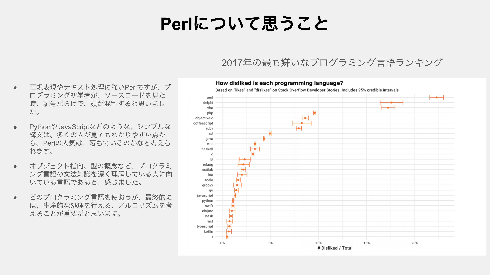
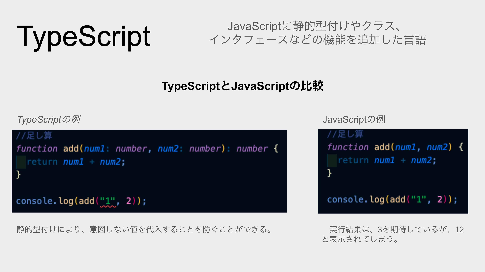
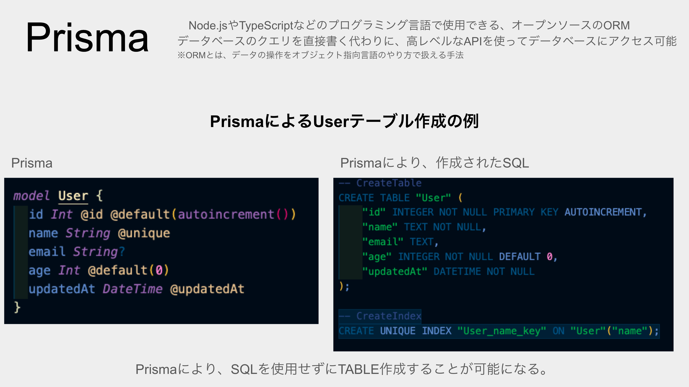
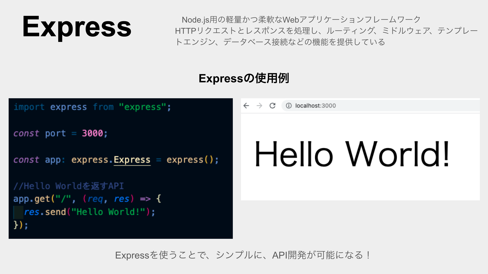
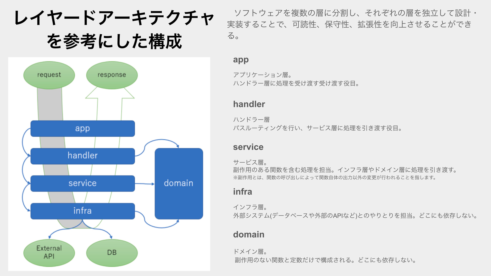
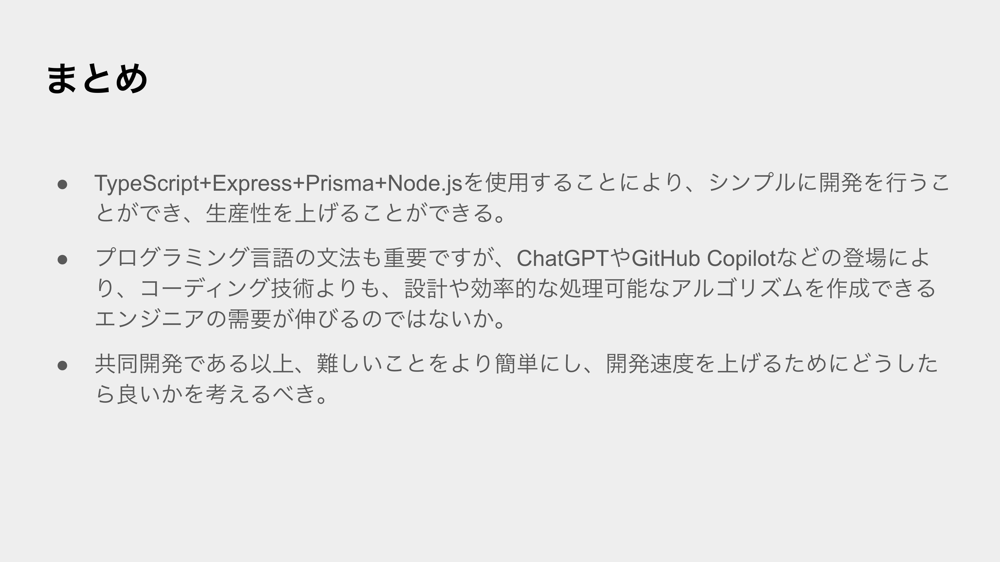

# YAPC::Kyoto 2023
&emsp;3/19 に [YAPC::Kyoto 2023](https://yapcjapan.org/2023kyoto/) に参加してきました。

## YAPC::Kyoto 2023 前日祭
&emsp;3/18 には、[YAPC::Kyoto 2023 前日祭](https://yapcjapan.connpass.com/event/276583) に参加しました。

## ネコトーストラボ杯争奪 東西対抗 LTマッチ

&emsp;「YAPC::Kyoto 2023前日祭」内のイベント「ネコトーストラボ杯争奪 東西対抗 LTマッチ」に、登壇しました。

<X tweetId="1638784761748672514" />

&emsp;東側チームのMVPを受賞をすることができました。

## 登壇内容

&emsp;登壇内容は「TypeSciprt + Express + Prisma + Node.js API開発」。入社してから、初業務で学んだことをまとめた内容です。

## Perlについて思うこと

&emsp;冒頭では、Perlの本音について。
くじ引きで、一番最後の登壇なのでしたが、他の登壇者の発表を聞いた後、このスライドを作ったことを後悔。

&emsp;Perl愛好家が集まるイベントで、このスライドを発表するのは、空気を壊してしまうのではないかと、発表直前にとても不安になっていた。
 

## TypeScript
&emsp;TypeScriptは、JavaScriptの型を導入することで、JavaScriptの開発をより安全に、より効率的に行うことができる言語。

## Prisma
&emsp;手動でSQLクエリを書く必要ない。SQLを意識せずに、データ操作が可能。

## Express
&emsp;Node.jsのWebフレームワーク。軽量で、柔軟性が高い。

## レイヤードアーキテクチャーを参考にした構成
&emsp;各層を独立して設計しているため、役割が明確になる。Domain層により、コード量を大幅に抑えることが可能。

## まとめ
&emsp;開発する時には、自分のような初業務の人もいれば、ベテランエンジニア、営業の方など、様々な人がいる。全員が全員、同じような知識を持っているわけではないので、共通の知識を持った上で、開発を進めることが重要だと感じました。

## MVP賞

<X tweetId="1645386082308227072" />

## YAPC::Kyoto 2023:当日
&emsp;当日は、様々なタイムテーブルを回りました。

## 印象的な登壇内容

### 「マルチテナントの実現における技術選定の審美眼とDB設計 ~ PostgreSQLを添えて ~」

&emsp;登壇を聞けばデータベース設計について理解できた気になるくらい、シンプルでとても説明が分かりやすかった。

### ソフトウェアエンジニアリングサバイバルガイド: 廃墟を直す、廃墟を出る、廃墟を壊す、あるいは廃墟に暮らす、廃墟に死す

&emsp;ソフトウェアについても現実に存在する「モノ」のように定期的あるいは継続的なメンテナンスが必要であり、メンテナンスを楽にするためには、より簡潔なコーディングをするべきだと感じました。

## The end
&emsp;多様性を受け入れており、誰でも歓迎している感じが、YAPCイベントの良さだと思いました。私は、今回の「YAPC::Kyoto 2023」が、初参加のITカンファレンスで、LTに登壇するのも初めてでした。また、知見を深められ、業務に役に立てられるように感じました。