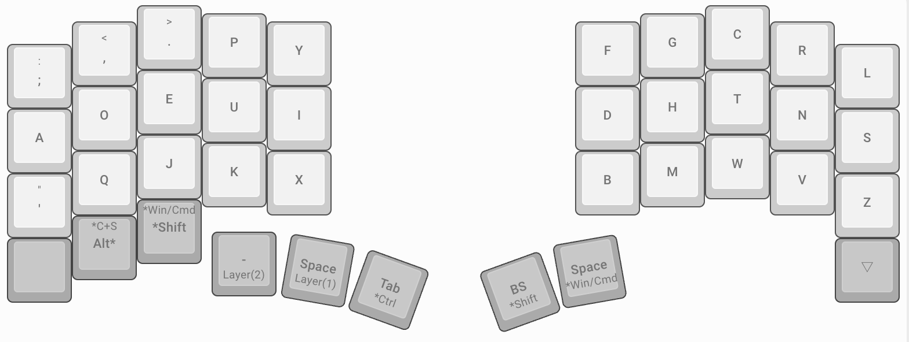
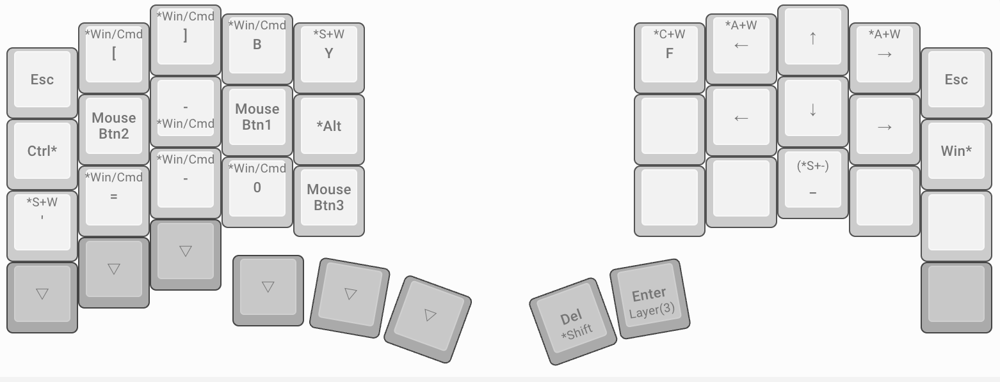
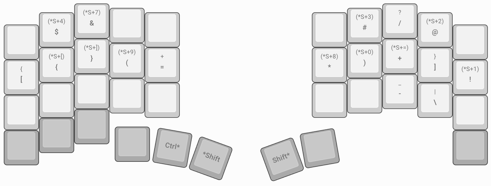

# Dvorak
&emsp;Dvorakについて考える。

## Custom Dvorak
&emsp;キーマップ沼にハマり、キーマップを考えるのがめんどくさくなった。[Programmer Dvorak](https://www.kaufmann.no/roland/dvorak/)という配列を見つけたので、レイヤーを駆使し、ホームポジションから、手を動かなさくて済むように、カスタムキーマップを考えた。(改良の余地あり)

### レイヤー0
&emsp;Dvorak配列にする。

### レイヤー1
&emsp;左右クリック、タブ切り替え、拡大縮小...。その他ショートカットキーを配置。[karabiner-elements](https://karabiner-elements.pqrs.org/)で上書きしている部分もあります。

## Shortcut keys (frequently used, others...)

### GUIで便利なもの
|ショートカットキー|効果|
|---|---|
|cmd + [|戻る(ブラウザ)|
|cmd + ]|進む(ブラウザ)|
|alt + cmd + →|右タブ切り替え(ブラウザ)|
|alt + cmd + ←|左タブ切り替え(ブラウザ)|
|ctr + →|仮想デスクトップ切り替え(右)|
|ctr + ←|仮想デスクトップ切り替え(左)|
|ctr + ↑|ウィンドウの切り替え|
|ctr + ↓|ウィンドウの切り替え|
|cmd + =|拡大|
|cmd + -|縮小|
|cmd + 0|比率リセット|

### 文字列移動
|ショートカットキー|効果|
|---|---|
|cmd + →|右末尾|
|cmd + ←|左末尾|
|cmd + ↑|上末尾|
|cmd + ↓|下末尾|
|opt + →|右単語|
|opt + ←|左単語|

### 文字列選択
|ショートカットキー|効果|
|---|---|
|shift + →|文字列選択(右一文字)|
|shift + ←|文字列選択(左一文字)|
|shift + ↑|文字列選択(上一文字)|
|shift + ↓|文字列選択(上一文字)|
|shift + cmd + →|文字列選択(右末尾)|
|shift + cmd + ←|文字列選択(左末尾)|
|shift + cmd + ↑|文字列選択(上末尾)|
|shift + cmd + ↓|文字列選択(下末尾)|
|shift + opt + →|文字列選択(右単語)|
|shift + opt + ←|文字列選択(左単語)|

### Other

|変換前|変換後|
|---|---|
|cmd + b|cmd + n|
|cmd + shift + y |cmd + shift + t|
|cmd + + ctr + f|cmd + ctr + y|
|cmd + shift + '|cmd + shift + z|

### レイヤー2
&emsp;Layer(2)を押下時。

### レイヤー3
&emsp;Layer(3)を押下時。

## DvorakでQWERTYのShortcut Key
&emsp;Dvorak を使うとショートカットキーがメチャクチャになる。
対策として、[karabiner-elements](https://karabiner-elements.pqrs.org/)で、ショートカットキーを Qwerty と同じにしている。

### 変換例(押された時に、上書きされるように設定している)

|変換前|変換後|
|---|---|
|cmd + '|cmd + z|
|cmd + q|cmd + x|
|cmd + j|cmd + c|
|cmd + k|cmd + v|
|cmd + x|cmd + b|

## Vim、Other Tools
&emsp;Vim は、気合いで頑張るか、別レイヤーを組むなどの対策

## 日本語入力
&emsp;`k`を使った入力がかなりきつい。別の入力方式でも良いかも。

- 大西配列
- Tomisuke配列
- Astarte配列
- DvorakJP