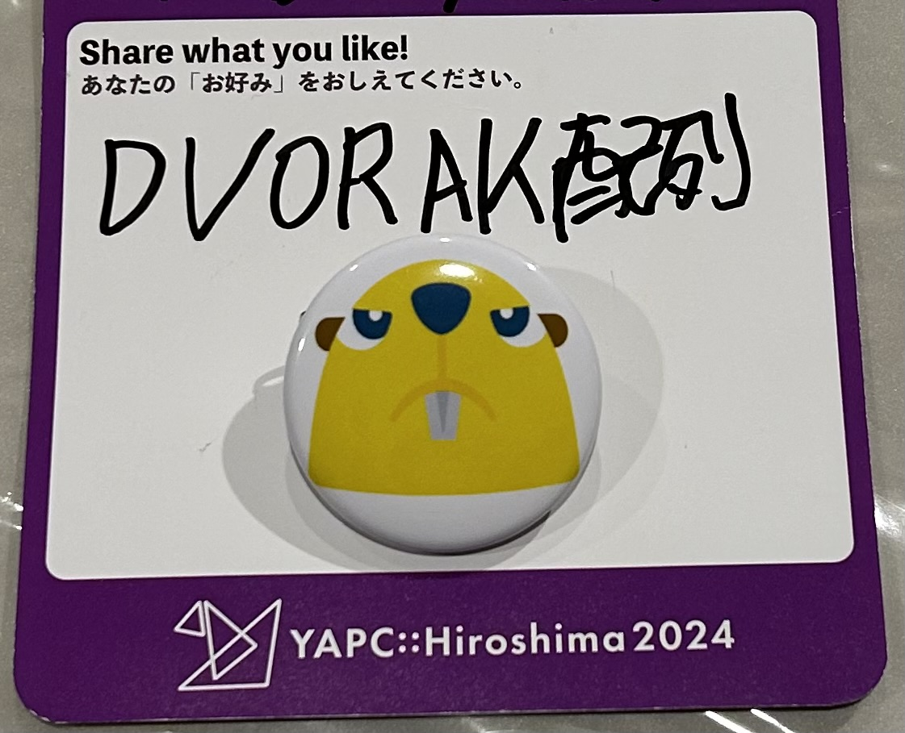
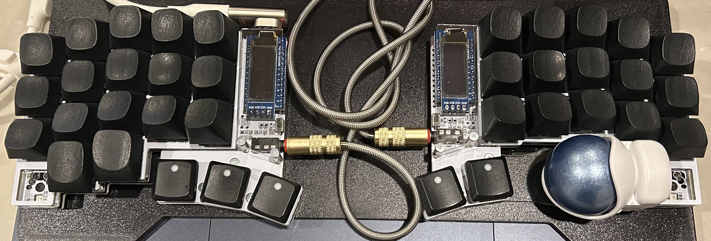

# YAPC::Hiroshima 2024
&emsp;2/10 に [YAPC::Hiroshima 2024](https://yapcjapan.org/2024hiroshima) に参加してきました。

&emsp;基本的に、無趣味なのですが、キーマップ沼によくハマっています。



# YAPC::Hiroshima 2024 前日祭
&emsp;2/9 には、[YAPC::Hiroshima 前夜祭](https://blog.yapcjapan.org/entry/2023/11/29/180000) に参加しました。

<X tweetId="1755918225265848658" />

<X tweetId="1755918672206647334" />

## YAPC::Hiroshima 2024 当日

## コミュニティと共に生きる

<X tweetId="1755896156901851534" />

```
Better late than never.
遅くても、やらないよりはやったほうがいい
```

```
手を動かしたものだけが、世界を変える
```

## 関数型プログラミングと型システムのメンタルモデル

<X tweetId="1756158213622522050" />

&emsp;型に対する捉え方の幅がとても広がった。ユニオン型を使うことにより、余計な状態を使わなくて済む。不要な状態が少なければ少ないほどの関数の正しさをチェックすることができるなど。

## プログラムを書いて楽しむ自作キーボードの世界
&emsp;プログラムを書き、自作キーボードでプログラムを書いていく無限ループ。

<X tweetId="1756289043309179325" />

### My Keyboard


&emsp;キーマップ沼は深い。私は、`Dvorak`をカスタムした配列を使用している。

<!-- [Dvorak配列に移行しました。](../../../keyboard/dvorak)

[函館市電LT参加してきました。](../../hakodate/hakodate_tram) -->

## とほほのWWW入門
[とほほのWWW入門](https://www.tohoho-web.com/)

&emsp;様々な入門について。

<X tweetId="1756243334186848287" />

## The End
&emsp;去年に続き、2回目の参加です。来年も、参加すると思います。

## Past YAPC

* [YAPC::Kyoto 2023 に参加](/posts/2023/03/01)