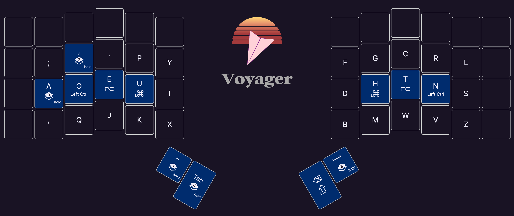
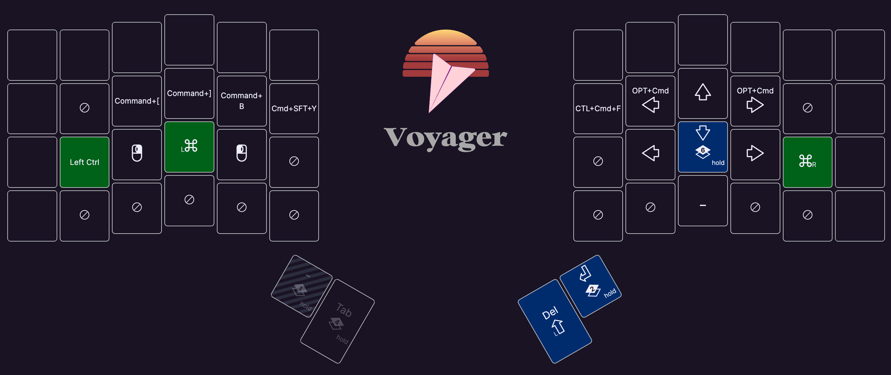
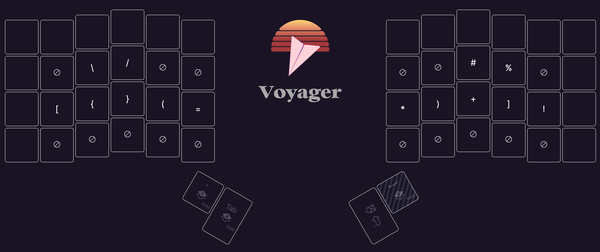
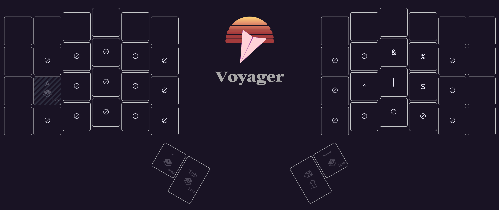
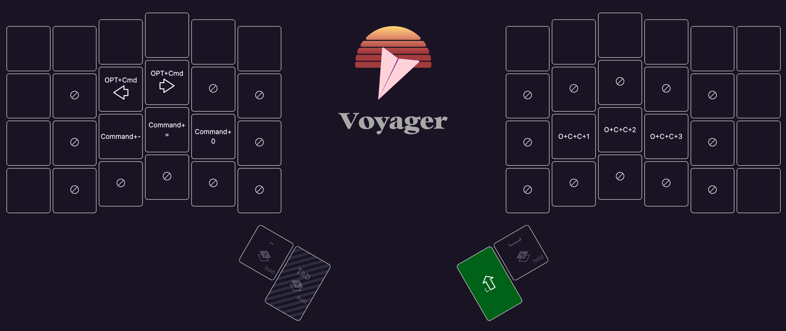
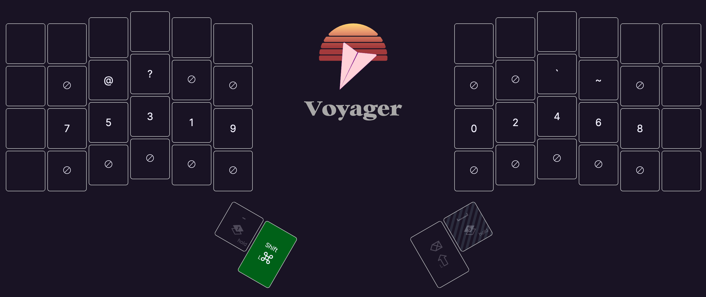
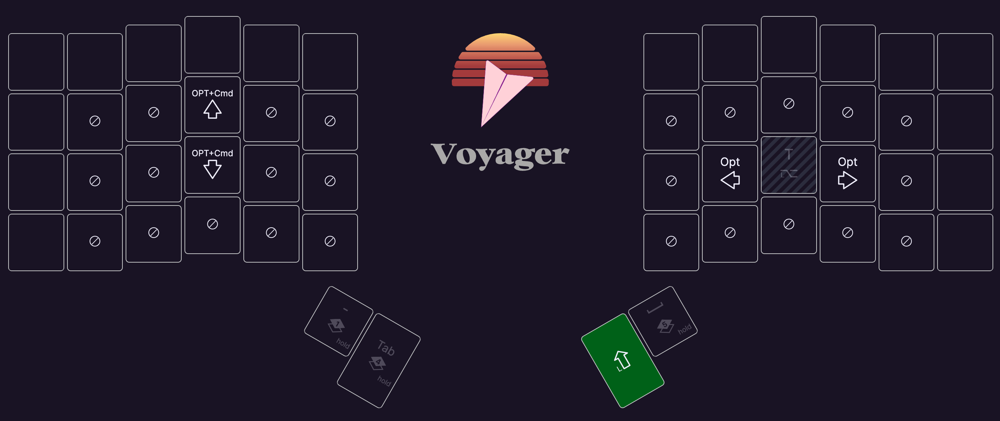
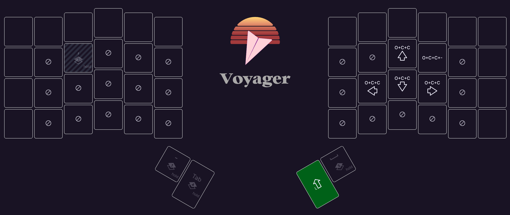

# Custom Dvorak 34

&emsp;[KeyBall39](https://shop.yushakobo.jp/products/5357)で、[Programmer Dvorak](https://www.kaufmann.no/roland/dvorak/)を参考に、キーマップを考えていました。

* [Custom Dvorak](../2023/03.md)

&emsp;YouTubeでこのような動画を見つけ、[Voyager](https://www.zsa.io/voyager)が気になり、購入しました。
<YouTube videoId="dg2TT1OJlQs" />

## My Custom Dvorak
:::tabs
== Layer 0

== Layer 1

== Layer 2

== Layer 3

== Layer 4

== Layer 5

== Layer 6

== Layer 7

:::

## Combos
&emsp;Dvorak配列の場合、`k`の入力での運指、`ls`コマンドなど使用する際、小指がきつい。どちらも、Combosで対応。`l`キーをCombosでしか使っていないので、削除しても問題ないかもしれない。

|同時押し|キー|
|---|---|
|h + t|k|
|c + r|l|

## Shortcut key
&emsp;Dvorak配列を使用すると、ショートカットキーはメチャクチャになる。[karabiner-elements](https://karabiner-elements.pqrs.org/)で、ショートカットキーをQwertyと同じ位置にして対応。

### 変換例(押された時に、上書きされるように設定している)
&emsp;以下は一部の変換例で、すべてのショートカットキーを上書きしています。

|変換前|変換後|
|---|---|
|cmd + '|cmd + z|
|cmd + q|cmd + x|
|cmd + j|cmd + c|
|cmd + k|cmd + v|
|cmd + x|cmd + b|

### Scroll
&emsp;右クリックを押している間にトラックボールを転がすと、スクロールされるように[Hammerspoon](https://www.hammerspoon.org/)で設定している。

::: code-group
```lua [init.lua]
local deferred = false

overrideRightMouseDown = hs.eventtap.new({ hs.eventtap.event.types.rightMouseDown }, function(e)
    deferred = true
    return true
end)

overrideRightMouseUp = hs.eventtap.new({ hs.eventtap.event.types.rightMouseUp }, function(e)
    if (deferred) then
        overrideRightMouseDown:stop()
        overrideRightMouseUp:stop()
        hs.eventtap.rightClick(e:location())
        overrideRightMouseDown:start()
        overrideRightMouseUp:start()
        return true
    end
    return false
end)

local oldmousepos = {}
local scrollmult = 4

dragRightToScroll = hs.eventtap.new({ hs.eventtap.event.types.rightMouseDragged }, function(e)
    deferred = false
    oldmousepos = hs.mouse.absolutePosition()
    local dx = e:getProperty(hs.eventtap.event.properties['mouseEventDeltaX'])
    local dy = e:getProperty(hs.eventtap.event.properties['mouseEventDeltaY'])
    local scroll = hs.eventtap.event.newScrollEvent({dx * scrollmult, dy * scrollmult},{},'pixel')
    hs.mouse.absolutePosition(oldmousepos)
    return true, {scroll}
end)

overrideRightMouseDown:start()
overrideRightMouseUp:start()
dragRightToScroll:start()
```
:::

## おわりに
&emsp;次は、おさかなキーボードを使用してみたい。

<X tweetId="1782525876988756315" />