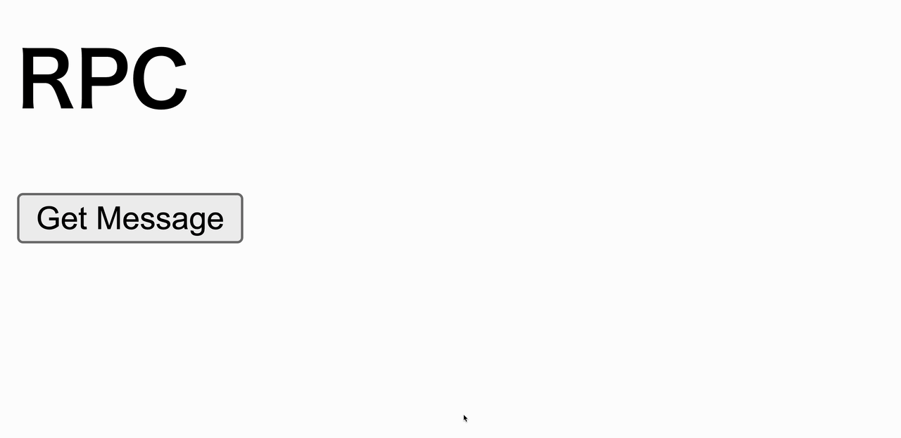

# HonoX RPC

* [RPC](https://hono.dev/docs/guides/rpc)

* [見よ、これがHonoのRPCだ](https://zenn.dev/yusukebe/articles/a00721f8b3b92e)

## Directory Structure
```
.
|-- app
|   |-- client.ts
|   |-- global.d.ts
|   |-- islands
|   |   `-- index.tsx
|   |-- routes
|   |   |-- _404.tsx
|   |   |-- _error.tsx
|   |   |-- _renderer.tsx
|   |   |-- api
|   |   |   `-- index.ts
|   |   `-- index.tsx
|   `-- server.ts
|-- bun.lockb
|-- package.json
|-- public
|   `-- favicon.ico
|-- tsconfig.json
|-- vite.config.ts
`-- wrangler.toml
```

## Easy API
::: code-group
```ts [app/api/routes/index.ts]
import { type Context, Hono } from 'hono'

const app = new Hono()

export const route = app.get('/', (c: Context) => {
  return c.json({ message: 'HonoX🔥' })
})

export default app
```
:::

## Client
::: code-group
```tsx [app/islands/index.tsx]
import { useState } from 'hono/jsx'
import { hc } from 'hono/client'
import { route } from '../routes/api'

const client = hc<typeof route>('/api')

const Client = () => {
  const [message, setMessage] = useState('')

  const onSubmit = async () => {
    const res = await client.index.$get()
    const data = await res.json()
    setMessage(data.message)
  }

  return (
    <>
      <h1>RPC</h1>
      <button onClick={onSubmit}>Get Message</button>
      <h1>{message}</h1>
    </>
  )
}

export default Client
```
:::

## Client import
::: code-group
```tsx [app/routes/index.tsx]
import { createRoute } from 'honox/factory'
import Client from '../islands'

export default createRoute((c) => {
  return c.render(<Client />)
})
```
:::

## Execution

