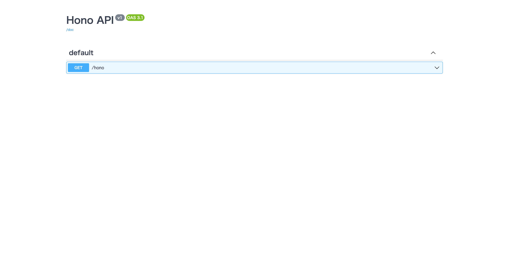
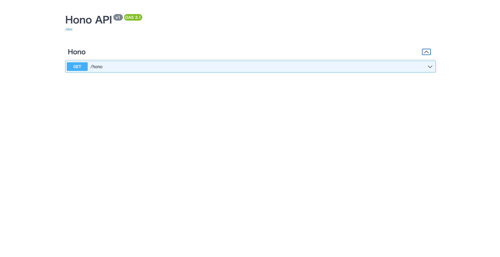
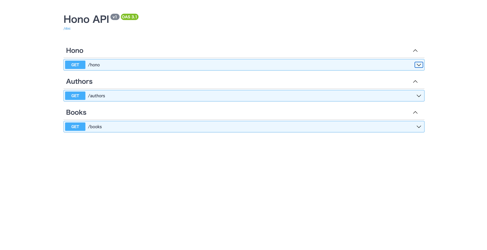
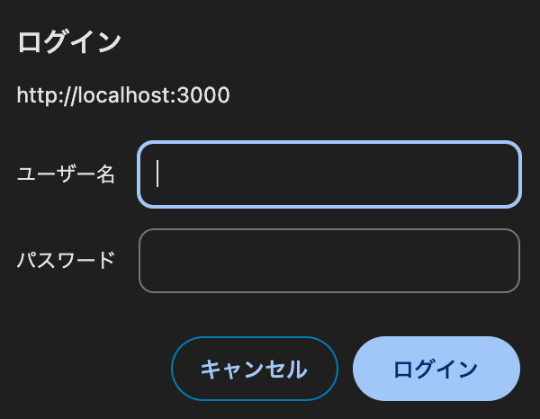

# Zod OpenAPI

* [Zod OpenAPI](https://hono.dev/examples/zod-openapi)

::: code-group
```ts [index.ts]
import { createRoute, OpenAPIHono, z } from '@hono/zod-openapi'

export const honoSchema = z.object({
  message: z.string().openapi({
    example: 'Hono🔥',
  }),
})

const route = createRoute({
  method: 'get',
  path: '/hono',
  responses: {
    200: {
      content: {
        'application/json': {
          schema: honoSchema,
        },
      },
      description: 'Hono🔥',
    },
  },
})

const app = new OpenAPIHono()

app.openapi(route, (c) => {
  return c.json({ message: 'Hono🔥' })
})

export default app
```
:::

## Hono API OAS
&emsp;`Hono`の機能を使用し、APIから、ドキュメントを自動生成。

&emsp;[OAS](https://www.openapis.org/)は、プログラミング言語に依存しないREST API記述フォーマット。以前は`Swagger Specification`と呼ばれている。

* [Swagger UI Middleware](https://github.com/honojs/middleware/tree/main/packages/swagger-ui)

* [Swagger UI](https://hono.dev/examples/swagger-ui)

::: code-group
```ts [index.ts]
import { createRoute, OpenAPIHono, z } from '@hono/zod-openapi'
import { swaggerUI } from '@hono/swagger-ui'

export const honoSchema = z.object({
  message: z.string().openapi({
    example: 'Hono🔥',
  }),
})

const route = createRoute({
  method: 'get',
  path: '/hono',
  responses: {
    200: {
      content: {
        'application/json': {
          schema: honoSchema,
        },
      },
      description: 'Hono🔥',
    },
  },
})

const app = new OpenAPIHono()

app.openapi(route, (c) => {
  return c.json({ message: 'Hono🔥' })
})

app.get('/ui', swaggerUI({ url: '/doc' }))

app.doc('/doc', {
  info: {
    title: 'Hono API',
    version: 'v1',
  },
  openapi: '3.1.0',
})

export default app
```
:::

## Accesse Browser
```
http://localhost:3000/ui
```

## Swagger UI



## Change default

::: code-group
```ts [index.ts]
import { createRoute, OpenAPIHono, z } from '@hono/zod-openapi'
import { swaggerUI } from '@hono/swagger-ui'

export const honoSchema = z.object({
  message: z.string().openapi({
    example: 'Hono🔥',
  }),
})

const route = createRoute({
  method: 'get',
  path: '/hono',
  responses: {
    200: {
      content: {
        'application/json': {
          schema: honoSchema,
        },
      },
      description: 'Hono🔥',
    },
  },
  tags: ['Hono'],
})

const app = new OpenAPIHono()

app.openapi(route, (c) => {
  return c.json({ message: 'Hono🔥' })
})

app.get('/ui', swaggerUI({ url: '/doc' }))

app.doc('/doc', {
  info: {
    title: 'Hono API',
    version: 'v1',
  },
  openapi: '3.1.0',
})

export default app

```
:::

## Accesse Browser
```
http://localhost:3000/ui
```

## Swagger UI



## Experiment

## Directory Structure
```
.
`-- hono
    |-- src
    |   |-- handler
    |   |   |-- authors.ts
    |   |   `-- books.ts
    |   `-- index.ts
    `-- tsconfig.json
```

::: code-group
```ts [hono/src/index.ts]
// index.ts
import { createRoute, OpenAPIHono, z } from '@hono/zod-openapi'
import { swaggerUI } from '@hono/swagger-ui'
import authors from './handler/authors'
import books from './handler/books'

export const honoSchema = z.object({
  message: z.string().openapi({
    example: 'Hono🔥',
  }),
})

const route = createRoute({
  method: 'get',
  path: '/hono',
  responses: {
    200: {
      content: {
        'application/json': {
          schema: honoSchema,
        },
      },
      description: 'Hono🔥',
    },
  },
  tags: ['Hono'],
})

const app = new OpenAPIHono()

app.openapi(route, (c) => {
  return c.json({ message: 'Hono🔥' })
})

app.route('/authors', authors)
app.route('/books', books)

app.get('/ui', swaggerUI({ url: '/doc' }))

app.doc('/doc', {
  info: {
    title: 'Hono API',
    version: 'v1',
  },
  openapi: '3.1.0',
})

export default app
```

```ts [hono/src/handler/authors.ts]
// authors.ts
import { createRoute, OpenAPIHono, z } from '@hono/zod-openapi'
import { z } from '@hono/zod-openapi'

const authorsSchema = z.object({
  message: z.string().openapi({
    example: 'Authors📝',
  }),
})

const route = createRoute({
  method: 'get',
  path: '/',
  responses: {
    200: {
      content: {
        'application/json': {
          schema: authorsSchema,
        },
      },
      description: 'Authors📝',
    },
  },
  tags: ['Authors'],
})

const app = new OpenAPIHono()

app.openapi(route, (c) => {
  return c.json({ message: 'Authors📝' })
})

export default app
```

```ts [hono/src/handler/books.ts]
// books.ts
import { createRoute, OpenAPIHono, z } from '@hono/zod-openapi'

export const bookSchema = z.object({
  message: z.string().openapi({
    example: 'Book📚',
  }),
})

const route = createRoute({
  method: 'get',
  path: '/',
  responses: {
    200: {
      content: {
        'application/json': {
          schema: bookSchema,
        },
      },
      description: 'Books📚',
    },
  },
  tags: ['Books'],
})

const app = new OpenAPIHono()

app.openapi(route, (c) => {
  return c.json({ message: 'Books📚' })
})

export default app
```
:::

## Swagger UI

## Accesse Browser
```
http://localhost:3000/ui
```



## `app.route` not mounted on the paths
&emsp;`createRoute`の`path`に直接指定する。

::: code-group
```ts [hono/src/index.ts]
// index.ts
import { createRoute, OpenAPIHono, z } from '@hono/zod-openapi'
import { swaggerUI } from '@hono/swagger-ui'
import authors from './handler/authors'
import books from './handler/books'

export const honoSchema = z.object({
  message: z.string().openapi({
    example: 'Hono🔥',
  }),
})

const route = createRoute({
  method: 'get',
  path: '/hono',
  responses: {
    200: {
      content: {
        'application/json': {
          schema: honoSchema,
        },
      },
      description: 'Hono🔥',
    },
  },
  tags: ['Hono'],
})

const app = new OpenAPIHono()

app.openapi(route, (c) => {
  return c.json({ message: 'Hono🔥' })
})

app.route('/', authors)
app.route('/', books)

app.get('/ui', swaggerUI({ url: '/doc' }))

app.doc('/doc', {
  info: {
    title: 'Hono API',
    version: 'v1',
  },
  openapi: '3.1.0',
})

export default app
```

```ts [hono/src/handler/authors.ts]
// authors.ts
import { createRoute, OpenAPIHono, z } from '@hono/zod-openapi'

const authorsSchema = z.object({
  message: z.string().openapi({
    example: 'Authors📝',
  }),
})

const route = createRoute({
  method: 'get',
  path: '/authors',
  responses: {
    200: {
      content: {
        'application/json': {
          schema: authorsSchema,
        },
      },
      description: 'Authors📝',
    },
  },
  tags: ['Authors'],
})

const app = new OpenAPIHono()

app.openapi(route, (c) => {
  return c.json({ message: 'Authors📝' })
})

export default app
```

```ts [hono/src/handler/books.ts]
import { createRoute, OpenAPIHono, z } from '@hono/zod-openapi'

export const bookSchema = z.object({
  message: z.string().openapi({
    example: 'Book📚',
  }),
})

const route = createRoute({
  method: 'get',
  path: '/books',
  responses: {
    200: {
      content: {
        'application/json': {
          schema: bookSchema,
        },
      },
      description: 'Books📚',
    },
  },
  tags: ['Books'],
})

const app = new OpenAPIHono()

app.openapi(route, (c) => {
  return c.json({ message: 'Books📚' })
})

export default app
```
:::

## Basic Auth

* [Basic Auth Middleware](https://hono.dev/docs/middleware/builtin/basic-auth#basic-auth-middleware)

::: code-group
```ts [hono/src/index.ts]
// index.ts
import { createRoute, OpenAPIHono, z } from '@hono/zod-openapi'
import { swaggerUI } from '@hono/swagger-ui'
import { basicAuth } from 'hono/basic-auth'
import authors from './handler/authors'
import books from './handler/books'

const app = new OpenAPIHono()

export const honoSchema = z.object({
  message: z.string().openapi({
    example: 'Hono🔥',
  }),
})

const route = createRoute({
  method: 'get',
  path: '/hono',
  responses: {
    200: {
      content: {
        'application/json': {
          schema: honoSchema,
        },
      },
      description: 'Hono🔥',
    },
  },
  tags: ['Hono'],
})

app.openapi(route, (c) => {
  return c.json({ message: 'Hono🔥' })
})

app.use('/auth/*', basicAuth({ username: 'hono', password: 'swagger' }))

app.get('/auth/ui', swaggerUI({ url: '/auth/doc' }))

app.doc('/auth/doc', {
  info: {
    title: 'Hono API',
    version: 'v1',
  },
  openapi: '3.1.0',
})

app.route('/', authors)
app.route('/', books)

export default app
```
:::

## Accesse Browser

```
http://localhost:3000/auth/ui
```

