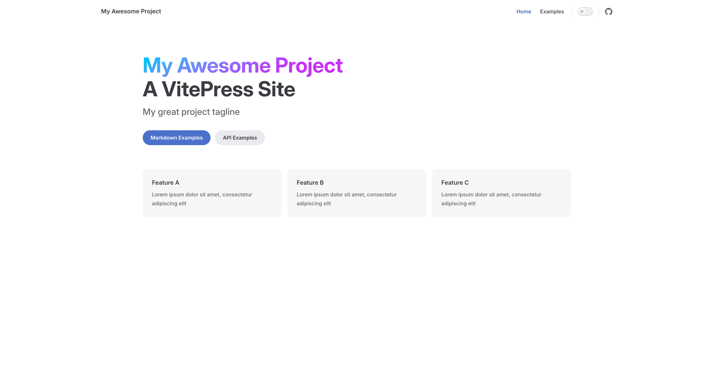
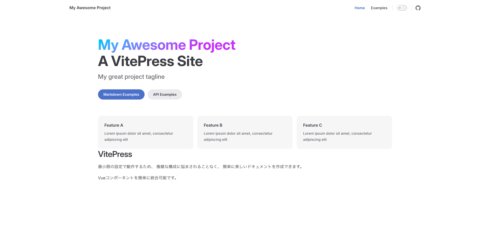
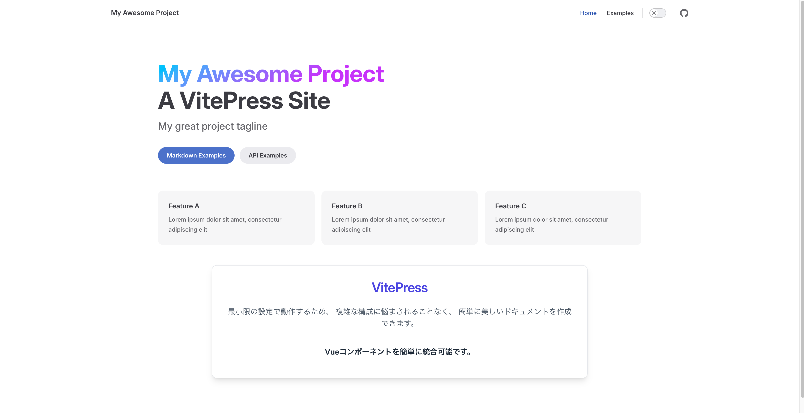
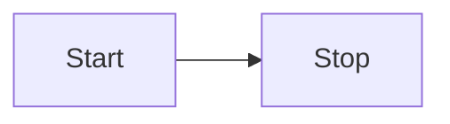

# VitePress

::: code-group
```sh [bun]
bun add -D vitepress
```
:::

::: code-group
```sh [bun]
bun vitepress init
```
:::

```sh
┌  Welcome to VitePress!
│
◇  Where should VitePress initialize the config?
│  ./
│
◇  Site title:
│  My Awesome Project
│
◇  Site description:
│  A VitePress Site
│
◇  Theme:
│  Default Theme + Customization
│
◇  Use TypeScript for config and theme files?
│  Yes
│
◇  Add VitePress npm scripts to package.json?
│  Yes
│
└  Done! Now run bun run docs:dev and start writing.

Tips:
- Make sure to add .vitepress/dist and .vitepress/cache to your .gitignore file.
- Since you've chosen to customize the theme, you should also explicitly install vue as a dev dependency.
```

## Directory Structure
```
.
|-- .vitepress
|   |-- config.mts
|   `-- theme
|       |-- index.ts
|       `-- style.css
|-- api-examples.md
|-- index.md
|-- markdown-examples.md
`-- package.json
```

::: code-group
```sh [bun]
bun run docs:dev
```
:::

## Accesse Browser
```
http://localhost:5173/
```



## Vue Components

```
.
|-- .vitepress
|   |-- components
|   |   |-- VitePress.vue
|   |   `-- YouTube.vue
|   |-- config.mts
|   `-- theme
|       |-- config.ts
|       |-- custom.css
|       `-- index.ts
|-- index.md
|-- package.json
|-- postcss.config.js
`-- tailwind.config.js
```

::: code-group
```vue [.vitepress/components/VitePress.vue]
<script lang="ts" setup>
const title: string = 'VitePress'
const description: string = `最小限の設定で動作するため、
複雑な構成に悩まされることなく、
簡単に美しいドキュメントを作成できます。`
const feature: string = 'Vueコンポーネントを簡単に統合可能です。'
</script>

<template>
    <div>
        <h1>{{ title }}</h1>
        <p>{{ description }}</p>
        <p>{{ feature }}</p>
    </div>
</template>
```

```ts [.vitepress/theme/index.ts]
// https://vitepress.dev/guide/custom-theme
import { h } from 'vue'
import type { Theme } from 'vitepress'
import DefaultTheme from 'vitepress/theme'
import './style.css'
// import Components
import VitePress from '../components/VitePress.vue'

export default {
  extends: DefaultTheme,
  Layout: () => {
    return h(DefaultTheme.Layout, null, {
      // https://vitepress.dev/guide/extending-default-theme#layout-slots
    })
  },
  enhanceApp({ app }) {
    app.component('VitePress', VitePress)
  },
} satisfies Theme
```
:::

::: code-group
```md [index.md]
---
# https://vitepress.dev/reference/default-theme-home-page
layout: home

hero:
  name: "My Awesome Project"
  text: "A VitePress Site"
  tagline: My great project tagline
  actions:
    - theme: brand
      text: Markdown Examples
      link: /markdown-examples
    - theme: alt
      text: API Examples
      link: /api-examples

features:
  - title: Feature A
    details: Lorem ipsum dolor sit amet, consectetur adipiscing elit
  - title: Feature B
    details: Lorem ipsum dolor sit amet, consectetur adipiscing elit
  - title: Feature C
    details: Lorem ipsum dolor sit amet, consectetur adipiscing elit
---

<VitePress />
```
:::



## Tailwind CSS

::: code-group
```sh [bun]
bun add -d tailwindcss postcss autoprefixer
```
:::

::: code-group
```sh [bun]
bunx tailwindcss init
```
:::

::: code-group
```js [postcss.config.js]
export default {
  plugins: {
    tailwindcss: {},
    autoprefixer: {},
  },
}
```
:::

::: code-group
```js [tailwind.config.js]
/** @type {import('tailwindcss').Config} */
export default {
  content: ['.vitepress/**/*.{vue,md}'],
  theme: {
    extend: {},
  },
  plugins: [],
}
```
:::

::: code-group
```css [.vitepress/theme/style.css]
@import "tailwindcss/base";
@import "tailwindcss/components";
@import "tailwindcss/utilities";
...
```
:::

## Vue & Tailwind CSS Example

::: code-group
```ts [.vitepress/components/VitePress.vue]
<script lang="ts" setup>
const title: string = 'VitePress'
const description: string = `最小限の設定で動作するため、
複雑な構成に悩まされることなく、
簡単に美しいドキュメントを作成できます。`
const feature: string = 'Vueコンポーネントを簡単に統合可能です。'
</script>

<template>
    <div class="max-w-4xl mx-auto p-8 bg-white shadow-lg rounded-xl mt-12 border border-gray-200">
        <h1 class="text-5xl font-extrabold text-center text-indigo-600 mb-6">{{ title }}</h1>
        <p class="text-lg text-gray-600 mb-4 leading-relaxed text-center">{{ description }}</p>
        <div class="flex items-center justify-center space-x-2 mt-6">
            <p class="text-lg text-gray-800 font-semibold">{{ feature }}</p>
        </div>
    </div>
</template>
```
:::



## Youtube Embed

::: code-group
```vue [.vitepress/components/YouTube.vue]
<script>
export default {
  props: {
    videoId: {
      type: String,
      required: true,
    },
  },
}
</script>

<template>
  <div class="video-container">
    <iframe width="560" height="315" :src="`https://www.youtube.com/embed/${videoId}`" frameborder="0"
      allow="accelerometer; autoplay; clipboard-write; encrypted-media; gyroscope; picture-in-picture"
      allowfullscreen></iframe>
  </div>
</template>

<style scoped>
.video-container {
  position: relative;
  padding-bottom: 56.25%;
  height: 0;
  overflow: hidden;
  max-width: 100%;
  background: #000;
}

.video-container iframe {
  position: absolute;
  top: 0;
  left: 0;
  width: 100%;
  height: 100%;
}
</style>
```

```ts [.vitepress/theme/index.ts]
// https://vitepress.dev/guide/custom-theme
import { h } from 'vue'
import type { Theme } from 'vitepress'
import DefaultTheme from 'vitepress/theme'
// import Components 
import VitePress from '../components/VitePress.vue'
import YouTube from '../components/YouTube.vue'

export default {
  extends: DefaultTheme,
  Layout: () => {
    return h(DefaultTheme.Layout, null, {
      // https://vitepress.dev/guide/extending-default-theme#layout-slots
    })
  },
  enhanceApp({ app }) {
    app.component('VitePress', VitePress)
    app.component('YouTube', YouTube)
  },
} satisfies Theme
```
:::

* `https://www.youtube.com/watch?v=***` : `***`

::: code-group
```md [*.md]
<YouTube videoId="***" />
```
:::

## Example

<YouTube videoId="sYZW8TK2IV4" />

## Vitepress Plugin Group Icons

* [Vitepress Plugin Group Icons](https://vp.yuy1n.io/)

::: code-group
```sh [bun]
bun add -d vitepress-plugin-group-icons
```
:::

::: code-group
```ts [.vitepress/theme/index.ts]
import Theme from 'vitepress/theme'
import 'virtual:group-icons.css'
...
```

```ts [.vitepress/config.mts]
import Theme from 'vitepress/theme'
import 'virtual:group-icons.css'
...
```
:::

## vitepress-plugin-tabs

* [vitepress-plugin-tabs](https://vitepress-plugins.sapphi.red/tabs/)

::: code-group
```sh [bun]
bun add -d vitepress-plugin-tabs
```
:::

::: code-group
```ts [.vitepress/config.mts]
import { defineConfig } from 'vitepress'
import { tabsMarkdownPlugin } from 'vitepress-plugin-tabs'

export default defineConfig({
  markdown: {
    config(md) {
      md.use(tabsMarkdownPlugin)
    }
  }
})
```

```ts [.vitepress/theme/index.ts]
import type { Theme } from 'vitepress'
import DefaultTheme from 'vitepress/theme'
import { enhanceAppWithTabs } from 'vitepress-plugin-tabs/client'

export default {
  extends: DefaultTheme,
  enhanceApp({ app }) {
    enhanceAppWithTabs(app)
  }
} satisfies Theme
```
:::

## Mermaid

* [VitePress Plugin Mermaid](https://emersonbottero.github.io/vitepress-plugin-mermaid/)


::: code-group
```sh [bun]
bun add -d vitepress-plugin-mermaid
```
:::


::: code-group
```ts [.vitepress/config.mts]
import { defineConfig } from 'vitepress'
import { withMermaid } from 'vitepress-plugin-mermaid'

// https://vitepress.dev/reference/site-config
export default withMermaid(
  defineConfig({
    ...
  }),
)
```
:::

```mmd
flowchart LR
  Start --> Stop
```



## PlantUML

::: code-group
```sh [bun]
bun add -d markdown-it-plantuml
```
:::

::: code-group
```ts [.vitepress/config.mts]
import { defineConfig } from 'vitepress'
import markdownItPlantuml from 'markdown-it-plantuml'

// https://vitepress.dev/reference/site-config
export default defineConfig({
  markdown: {
    config(md) {
      md.use(markdownItPlantuml)
    },
  },
  ...
})
```
:::

```
@startuml
Bob -> Alice : こんにちは！
@enduml
```

@startuml
Bob -> Alice : こんにちは！
@enduml