# Npm Prisma

## Directory Structure
```
.
|-- package.json
|-- prisma
|   |-- dev.db
|   |-- migrations
|   |   |-- *_init
|   |   |   `-- migration.sql
|   |   `-- migration_lock.toml
|   `-- schema.prisma
|-- src
|   `-- index.ts
`-- tsconfig.json

```

## Environment Build
::: code-group
```sh [npm]
npm install prisma --save-dev
```
:::

::: code-group
```sh [npm]
npm install @prisma/client
```
:::

::: code-group
```sh [.env]
DATABASE_URL="file:./dev.db"
```
:::

## `schema.prisma`作成
::: code-group
```sh [npm]
npx prisma init --datasource-provider sqlite
```
:::


## Migrate
::: code-group
```sh [npm]
npx prisma migrate dev --name init
```
:::

::: code-group
```ts [src/index.ts]
import { PrismaClient } from '@prisma/client'

const prisma = new PrismaClient()

const deleteUsers = async () => {
  await prisma.user.deleteMany()
}

deleteUsers()

const createUsers = async () => {
  await prisma.user.createMany({
    data: [
      {
        id: 1,
        name: 'prisma',
        email: 'prisma@email.com',
      },
      {
        id: 2,
        name: 'drizzle',
        email: 'drizzle@email.com',
      },
      {
        id: 3,
        name: 'typeorm',
        email: 'typeorm@email.com',
      },
    ],
  })
}

const main = async () => {
  await createUsers()
  const users = await prisma.user.findMany()
  console.log(users)
}

main()
  .catch((e) => {
    console.error(e)
    process.exit(1)
  })
  .finally(async () => {
    await prisma.$disconnect()
  })

```
:::

## Execution
```
[
  { id: 1, email: 'prisma@email.com', name: 'prisma' },
  { id: 2, email: 'drizzle@email.com', name: 'drizzle' },
  { id: 3, email: 'typeorm@email.com', name: 'typeorm' }
]
```

## Mermaid

* [prisma-erd-generator
](https://github.com/keonik/prisma-erd-generator)

::: code-group
```sh [npm]
npm install prisma-erd-generator --save-dev
```
:::

::: code-group
```prisma [prisma/schema.prisma]
generator client {
  provider = "prisma-client-js"
}

datasource db {
  provider = "sqlite"
  url      = env("DATABASE_URL")
}

generator erd {
  provider = "prisma-erd-generator"
  output = "er.md"
}

model User {
  id    Int     @id @default(autoincrement())
  email String  @unique
  name  String
}
```

```mmd [mermaid]
erDiagram

  "User" {
    Int id "🗝️"
    String email 
    String name 
    }
  
```
:::

## Generate
::: code-group
```sh [npm]
npx prisma generate
```
:::



```mermaid
erDiagram

  "User" {
    Int id "🗝️"
    String email 
    String name 
    }
  
```

## Other Example

::: code-group
```prisma [schema.prisma]
generator client {
  provider = "prisma-client-js"
}

datasource db {
  provider = "sqlite"
  url      = env("DATABASE_URL")
}

generator erd {
  provider = "prisma-erd-generator"
  output = "er.md"
}

model User {
  id    Int     @id @default(autoincrement())
  email String  @unique
  name  String
  posts Post[]
}

model Post {
  id        Int    @id @default(autoincrement())
  title     String
  content   String
  authorId  Int
  author    User   @relation(fields: [authorId], references: [id])
}
```

```mmd [mermaid]
erDiagram

  "User" {
    Int id "🗝️"
    String email 
    String name 
    }
  

  "Post" {
    Int id "🗝️"
    String title 
    String content 
    }
  
    "User" o{--}o "Post" : "posts"
    "Post" o|--|| "User" : "author"
```
:::



```mermaid
erDiagram

  "User" {
    Int id "🗝️"
    String email 
    String name 
    }
  

  "Post" {
    Int id "🗝️"
    String title 
    String content 
    }
  
    "User" o{--}o "Post" : "posts"
    "Post" o|--|| "User" : "author"
```

## PlantUML

* [prisma-generator-plantuml-erd](https://github.com/dbgso/prisma-generator-plantuml-erd/tree/main/packages/generator)

::: code-group
```sh [npm]
npm install prisma-generator-plantuml-erd --save-dev
```
:::


::: code-group
```prisma [prisma/schema.prisma]
generator client {
  provider = "prisma-client-js"
}

datasource db {
  provider = "sqlite"
  url      = env("DATABASE_URL")
}

generator erd_plantuml {
  provider   = "prisma-generator-plantuml-erd"
  output = "erd.puml"
  showUniqueKeyLabel = true
  isShowForeignKeyOnRelation = true
}

model User {
  id    Int     @id @default(autoincrement())
  email String  @unique
  name  String
  posts Post[]
}

model Post {
  id        Int    @id @default(autoincrement())
  title     String
  content   String
  authorId  Int
  author    User   @relation(fields: [authorId], references: [id])
}
```

```
@startuml erd
skinparam linetype ortho
entity "User" as User {
+ id [PK] : Int 
--
  * email : [UK] String
  * name : String
}

entity "Post" as Post {
+ id [PK] : Int 
--
  * title : String
  * content : String
  # authorId : [FK] User
}

' Relations
Post }o--|| User: authorId
' ManyToMany Relations
' enum relations
@enduml
```
:::

## Generate
::: code-group
```sh [npm]
npm install prisma-erd-generator --save-dev
```
:::

@startuml erd
skinparam linetype ortho
entity "User" as User {
+ id [PK] : Int 
--
  * email : [UK] String
  * name : String
}

entity "Post" as Post {
+ id [PK] : Int 
--
  * title : String
  * content : String
  # authorId : [FK] User
}

' Relations
Post }o--|| User: authorId
' ManyToMany Relations
' enum relations
@enduml

## Md

::: code-group
```prisma [prisma/schema.prisma]
generator client {
  provider = "prisma-client-js"
}

datasource db {
  provider = "sqlite"
  url      = env("DATABASE_URL")
}

generator erd_plantuml {
  provider   = "prisma-generator-plantuml-erd"
  exportPerTables      = true
  showUniqueKeyLabel = true
  isShowForeignKeyOnRelation = true
  markdownOutput       = "./example-tables.md"
  markdownIncludeERD      = true
}

model User {
  id    Int     @id @default(autoincrement())
  email String  @unique
  name  String
  posts Post[]
}

model Post {
  id        Int    @id @default(autoincrement())
  title     String
  content   String
  authorId  Int
  author    User   @relation(fields: [authorId], references: [id])
}
```
:::

## Generate

::: code-group
```sh [npm]
npm install prisma-erd-generator --save-dev
```
:::

::: details Generated Md
# Tables
- [User](#user)
- [Post](#post)

# ER diagram
```
@startuml erd
skinparam linetype ortho
entity "User" as User {
+ id [PK] : Int 
--
  * email : [UK] String
  * name : String
}

entity "Post" as Post {
+ id [PK] : Int 
--
  * title : String
  * content : String
  # authorId : [FK] User
}

' Relations
Post }o--|| User: authorId
' ManyToMany Relations
' enum relations
@enduml
```
# User

## Description


## Columns

|Name | Type | Default | Nullable | Unique | Children | Parent | Comment|
|--- | --- | --- | --- | --- | --- | --- | ---|
|id | Int | autoincrement | false | true | [Post](#post) |  | |
|email | String |  | false | true |  |  | |
|name | String |  | false | false |  |  | |

## ER diagram

```
@startuml User
skinparam linetype ortho
entity "User" as User {
+ id [PK] : Int 
--
  * email : [UK] String
  * name : String
}

entity "Post" as Post {
+ id [PK] : Int 
--
  * title : String
  * content : String
  # authorId : [FK] User
}

' Relations
Post }o--|| User: authorId
' ManyToMany Relations
' enum relations
@enduml
```
# Post

## Description


## Columns

|Name | Type | Default | Nullable | Unique | Children | Parent | Comment|
|--- | --- | --- | --- | --- | --- | --- | ---|
|id | Int | autoincrement | false | true |  |  | |
|title | String |  | false | false |  |  | |
|content | String |  | false | false |  |  | |
|authorId | Int |  | false | false |  | [User](#user) | |

## ER diagram

```
@startuml Post
skinparam linetype ortho
entity "User" as User {
+ id [PK] : Int 
--
  * email : [UK] String
  * name : String
}

entity "Post" as Post {
+ id [PK] : Int 
--
  * title : String
  * content : String
  # authorId : [FK] User
}

' Relations
Post }o--|| User: authorId
' ManyToMany Relations
' enum relations
@enduml
```
:::

## Options

### exportPerTables
&emsp;各テーブルが出力される。デフォルト値は`false`。

### showUniqueKeyLabel 
&emsp;`ER`図上で一意のキーとしてもラベル付けされる`[UK]`。デフォルト値は`false`。

### lineType

* ortho
* polyline
* unset

デフォルト値は`ortho`。

### isLeftToRightDirection

&emsp;`true`にすると、`PlantUML`が`left to right direction`指定される。

### lineLength
&emsp;線の長さを変更できる。デフォルト値は`--`。


## Prisma Markdown

* [Prisma Markdown](https://github.com/samchon/prisma-markdown)

::: code-group
```sh [npm]
npm install prisma-markdown --save-dev
```
:::

::: code-group
```prisma [prisma/schema.prisma]
generator markdown {
  provider = "prisma-markdown"
  output   = "./ERD.md"
  title    = "Prisma Markdown"
}
```
:::

## Generate
::: code-group
```sh [npm]
npx prisma generate
```
:::

::: details Generated Md
# Prisma Markdown
> Generated by [`prisma-markdown`](https://github.com/samchon/prisma-markdown)

- [default](#default)

## default


### `User`

**Properties**
  - `id`: 
  - `email`: 
  - `name`: 

### `Post`

**Properties**
  - `id`: 
  - `title`: 
  - `content`: 
  - `authorId`: 
:::