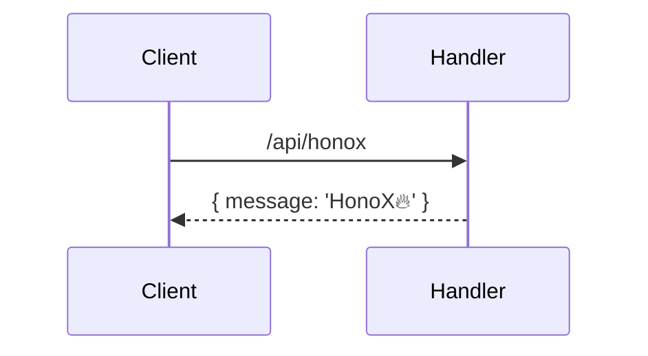

# TypeDoc
&emsp;`TypeDoc`から、`md`と`mermaid`を出力する。

* [TypeDoc](https://typedoc.org/)

:::code-group
```sh [yarn]
yarn add -D typedoc
```
:::


:::code-group
```sh [yarn]
yarn add -D typedoc-plugin-markdown
```
:::

&emsp;`entryPoints`を指定し、mdにするファイルを指定。
:::code-group
```json [typedoc.json]
{
  "entryPoints": ["./**/*.ts"]
}
```
:::

&emsp;`--out`で、出力先ディレクトリを指定。
:::code-group
```sh [yarn]
yarn typedoc --plugin typedoc-plugin-markdown --out ./docs/typedoc/ 
```
:::

## Mermaid
:::code-group
```sh [yarn]
yarn add -D typedoc-plugin-mermaid
```
:::

:::code-group
```json [typedoc.json]
{
  "entryPoints": ["./**/*.ts"],
  "plugin": ["typedoc-plugin-mermaid"]
}
```
:::

## Example
:::code-group
```ts [honox.ts]
import { OpenAPIHono } from '@hono/zod-openapi'
import { routes } from '../openapi'

export class HonoXHandler {
  /**
   * HonoX Handler apply
   * apply(app: OpenAPIHono)
   * @param app
   * routes['HonoX']
   * ```mermaid
   * sequenceDiagram
   *   Client ->> Handler: /api/honox
   *   Handler -->> Client: { message: 'HonoX🔥' }
   * ```
   */
  static apply(app: OpenAPIHono) {
    return app.openapi(routes['HonoX'], async (c) => {
      return c.json({ message: 'HonoX🔥' })
    })
  }
}
```
:::

&emsp;以下のように、生成できます。

## Methods

### apply()

> `static` **apply**(`app`): `OpenAPIHono`\<`Env`, `object`, `"/"`\>

HonoX Handler apply
apply(app: OpenAPIHono)

#### Parameters

• **app**: `OpenAPIHono`\<`Env`, `object`, `"/"`\>

routes['HonoX']


#### Returns

`OpenAPIHono`\<`Env`, `object`, `"/"`\>

## No Markdown
&emsp;`out`で指定した、ディレクトリに`html`ファイルが作成される。
:::code-group
```sh [yarn]
yarn typedoc
```
:::

:::code-group
```json [typedoc.json]
{
  "name": "Title",
  "entryPoints": ["./**/*.ts"],
  "out": "./docs/typedoc/"
}
```
:::