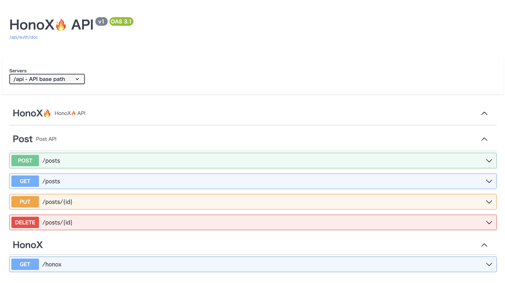
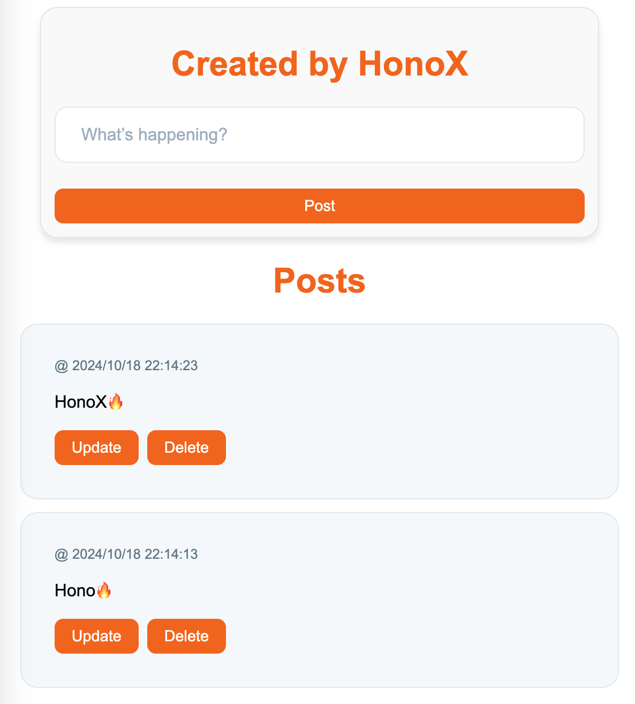

# HonoX Prisma

&emsp;HonoXのプロジェクトを立ち上げる。

:::code-group
```sh [yarn]
yarn create hono
```
:::

&emsp;APIを作成し、UIに表示させる。

## Directory Structure
```
.
├── app
│   ├── client.ts
│   ├── global.d.ts
│   ├── islands
│   │   └── index.tsx
│   ├── routes
│   │   ├── _404.tsx
│   │   ├── api.ts
│   │   ├── _error.tsx
│   │   ├── index.tsx
│   │   └── _renderer.tsx
│   └── server.ts
├── package.json
├── public
│   └── favicon.ico
├── tsconfig.json
├── vite.config.ts
└── wrangler.toml
```

## HonoX RPC

&emsp;簡単なAPIを作成する。

:::code-group
```ts [app/routes/api.ts]
import { createRoute, OpenAPIHono } from '@hono/zod-openapi'
import { z } from '@hono/zod-openapi'
import { hc } from 'hono/client'

export const honoSchema = z.object({
  message: z.string().openapi({
    example: 'HonoX🔥',
  }),
})

const app = new OpenAPIHono()

export const route = app.openapi(
  createRoute({
    method: 'get',
    path: '/honox',
    responses: {
      200: {
        content: {
          'application/json': {
            schema: honoSchema,
          },
        },
        description: 'HonoX🔥',
      },
    },
  }),
  (c) => {
    return c.json({ message: 'HonoX🔥' })
  },
)

export type AddType = typeof route
export const client = hc<AddType>('/api')
export default app
```
:::

&emsp;[RPC](https://hono.dev/docs/guides/rpc)を使用。

:::code-group
```tsx [app/islands/index.tsx]
import { useState } from 'hono/jsx'
import { client } from '../routes/api'

const HonoXIslands = () => {
  const [message, setMessage] = useState('')

  const onSubmit = async () => {
    const res = await client.honox.$get()
    const data = await res.json()
    setMessage(data.message)
  }

  return (
    <>
      <h1>RPC</h1>
      <button onClick={onSubmit}>Get Message</button>
      <h1>{message}</h1>
    </>
  )
}

export default HonoXIslands
```
:::

## Prisma

:::code-group
```sh [yarn]
yarn add prisma --dev
```
:::

:::code-group
```sh [yarn]
yarn add @prisma/client
```
:::

## Zod Prisma

* [Zod Prisma](https://github.com/CarterGrimmeisen/zod-prisma)

:::code-group
```sh [yarn]
yarn add -D zod-prisma
```
:::

:::code-group
```prisma [prisma/schema.prisma]
generator client {
  provider = "prisma-client-js"
}

datasource db {
  provider = "sqlite"
  url      = env("DATABASE_URL")
}

// schemaファイルから、Zodスキーマを生成する
generator zod {
  provider              = "zod-prisma"
  output                = "../app/zod/prisma/"
  relationModel         = true
  modelCase             = "camelCase"
  modelSuffix           = "Schema"
  useDecimalJs          = true
  prismaJsonNullability = true
}

model Post {
  /// ポストの一意のID
  /// @default {Generated by database}
  /// @zod.uuid()
  id        String   @id @default(uuid())
  /// ポストの内容
  /// @zod.min(1) 
  /// @zod.max(140)
  post      String
  /// ポストが作成された日時
  createdAt DateTime @default(now())
  /// ポストが最後に更新された日時
  updatedAt DateTime @updatedAt
}
```
:::


## Migrate

:::code-group
```sh [yarn]
yarn prisma migrate dev --name init
```
:::

## Generate
:::code-group
```sh [yarn]
yarn prisma generate
```
:::

## Directory Structure
```
.
├── app
│   ├── client.ts
│   ├── global.d.ts
│   ├── islands
│   │   └── index.tsx
│   ├── routes
│   │   ├── _404.tsx
│   │   ├── api.ts
│   │   ├── _error.tsx
│   │   ├── index.tsx
│   │   └── _renderer.tsx
│   ├── server.ts
│   └── zod
│       ├── honox
│       │   └── index.ts
│       └── prisma
│           ├── index.ts
│           └── post.ts
├── Makefile
├── package.json
├── prisma
│   ├── dev.db
│   ├── dev.db-journal
│   ├── migrations
│   │   ├── *_init
│   │   │   └── migration.sql
│   │   └── migration_lock.toml
│   └── schema.prisma
├── public
│   └── favicon.ico
├── tsconfig.json
├── vite.config.ts
└── wrangler.toml
```

&emsp;Zodが自動で生成されます。

:::code-group
```ts [app/zod/prisma/post.ts]
import * as z from 'zod'

export const postSchema = z.object({
  /**
   * ポストの一意のID
   * @default {Generated by database}
   */
  id: z.string().uuid(),
  /**
   * ポストの内容
   */
  post: z.string().min(1).max(140),
  /**
   * ポストが作成された日時
   */
  createdAt: z.date(),
  /**
   * ポストが最後に更新された日時
   */
  updatedAt: z.date(),
})
```
:::

## Zod OpenAPI

&emsp;[Zod OpenAPI](https://hono.dev/examples/zod-openapi)と組み合わせます。

## Directory Structure

```
├── app
│   ├── client.ts
│   ├── components
│   │   ├── Button
│   │   │   └── index.tsx
│   │   ├── Error
│   │   │   └── index.tsx
│   │   ├── Post
│   │   │   ├── PostForm.tsx
│   │   │   └── PostView.tsx
│   │   └── Title
│   │       └── index.tsx
│   ├── core
│   │   ├── domain
│   │   │   └── posts_domain.ts
│   │   ├── handler
│   │   │   ├── honox_handler.ts
│   │   │   ├── posts_handler.ts
│   │   │   └── swagger_handler.ts
│   │   ├── index.ts
│   │   ├── infra
│   │   │   └── prisma.ts
│   │   ├── openapi
│   │   │   ├── honox
│   │   │   │   └── index.ts
│   │   │   ├── index.ts
│   │   │   └── posts
│   │   │       └── index.ts
│   │   └── service
│   │       └── posts_service.ts
│   ├── global.d.ts
│   ├── islands
│   │   ├── hooks
│   │   │   ├── index.ts
│   │   │   └── post_hooks.ts
│   │   ├── index.tsx
│   │   └── post
│   │       ├── index.tsx
│   │       └── PostFormIslands.tsx
│   ├── routes
│   │   ├── _404.tsx
│   │   ├── api.ts
│   │   ├── _error.tsx
│   │   ├── index.tsx
│   │   ├── _renderer.tsx
│   │   └── tweet
│   │       └── index.tsx
│   ├── server.ts
│   ├── styles
│   │   └── index.ts
│   ├── types
│   │   ├── props.ts
│   │   └── state.ts
│   ├── utils
│   │   └── post_utils.ts
│   └── zod
│       ├── honox
│       │   └── index.ts
│       └── prisma
│           ├── index.ts
│           └── post.ts
├── package.json
├── prisma
│   ├── dev.db
│   ├── migrations
│   │   ├── *_init
│   │   │   └── migration.sql
│   │   └── migration_lock.toml
│   └── schema.prisma
├── public
│   └── favicon.ico
├── tsconfig.json
├── vite.config.ts
└── wrangler.toml
```

:::code-group 
```ts [[app/core/openapi/index.ts]]
import { honox } from './honox'
import { posts } from './posts'

export const routes = {
  ...honox,
  ...posts,
}
```
:::

:::details honox
:::code-group
```ts [app/core/openapi/honox/index.ts]
import { createRoute } from '@hono/zod-openapi'
import { honoxSchema } from '../../../zod/honox'

export const honox = {
  HonoX: createRoute({
    tags: ['HonoX'],
    method: 'get',
    path: '/honox',
    responses: {
      200: {
        description: 'HonoX🔥',
        content: {
          'application/json': {
            schema: honoxSchema,
          },
        },
      },
    },
  }),
}
```
:::

:::details posts
:::code-group
```ts [app/core/openapi/posts/index.ts]
import { createRoute, z } from '@hono/zod-openapi'
import { postSchema } from '../../../zod/prisma'

// 201 Created
const createdResponse = {
  201: {
    description: 'Created',
    content: {
      'application/json': {
        schema: z.object({
          message: z.string().openapi({
            example: 'Created',
          }),
        }),
      },
    },
  },
}

// 204 No Content
const NoContentResponse = {
  204: {
    description: 'No Content',
  },
}

// 400 Bad Request
const badRequestResponse = {
  400: {
    description: 'Bad Request',
    content: {
      'application/json': {
        schema: z.object({
          message: z.string().openapi({
            example: 'Bad Request',
          }),
        }),
      },
    },
  },
}

// 500 Internal Server Error
const internalServerErrorResponse = {
  500: {
    description: 'Internal Server Error',
    content: {
      'application/json': {
        schema: z.object({
          message: z.string().openapi({
            example: 'Internal Server Error',
          }),
        }),
      },
    },
  },
}

export const posts = {
  postPosts: createRoute({
    tags: ['Post'],
    method: 'post',
    path: '/posts',
    description: 'Create a new post',
    request: {
      body: {
        required: true,
        content: {
          'application/json': {
            schema: postSchema.pick({
              post: true,
            }),
          },
        },
      },
    },
    responses: {
      ...createdResponse,
      ...badRequestResponse,
      ...internalServerErrorResponse,
    },
  }),
  getPosts: createRoute({
    tags: ['Post'],
    method: 'get',
    path: '/posts',
    description: 'get PostList posts with optional pagination',
    request: {
      query: z.object({
        page: z.string(),
        limit: z.string(),
      }),
    },
    responses: {
      200: {
        description: 'OK',
        content: {
          'application/json': {
            schema: z.array(postSchema),
          },
        },
      },
      ...badRequestResponse,
      ...internalServerErrorResponse,
    },
  }),
  putPosts: createRoute({
    tags: ['Post'],
    method: 'put',
    path: '/posts/{id}',
    description: 'update Post',
    request: {
      params: z.object({
        id: z.string().uuid(),
      }),
      body: {
        required: true,
        content: {
          'application/json': {
            schema: postSchema.pick({ post: true }),
          },
        },
      },
    },
    responses: {
      ...NoContentResponse,
      ...badRequestResponse,
      ...internalServerErrorResponse,
    },
  }),
  deletePosts: createRoute({
    tags: ['Post'],
    method: 'delete',
    path: '/posts/{id}',
    description: 'delete post',
    request: {
      params: z.object({
        id: z.string().uuid(),
      }),
    },
    responses: {
      ...NoContentResponse,
      ...badRequestResponse,
      ...internalServerErrorResponse,
    },
  }),
}
```
:::

## Grouping routes for RPC

* [Grouping routes for RPC](https://hono.dev/examples/grouping-routes-rpc)

:::code-group
```ts [app/core/index.ts]
import { OpenAPIHono } from '@hono/zod-openapi'
import { basicAuth } from 'hono/basic-auth'
import { HonoXHandler } from './handler/honox_handler'
import { PostsHandler } from './handler/posts_handler'
import { SwaggerHandler } from './handler/swagger_handler'

export class App {
  private static username = process.env.SWAGGER_USER
  private static password = process.env.SWAGGER_PASSWORD
  static init() {
    const app = new OpenAPIHono()
    if (this.username && this.password) {
      app.use('/auth/*', basicAuth({ username: this.username, password: this.password }))
    }
    return this.applyRoutes(app)
  }

  static applyRoutes(app: OpenAPIHono) {
    return app
      .route('/', HonoXHandler.apply(app))
      .route('/', PostsHandler.apply(app))
      .route('/', SwaggerHandler.apply(app))
  }
}
```
:::

## Swagger UI

* [Swagger UI](https://hono.dev/examples/swagger-ui)

:::code-group
```ts [app/core/handler/swagger_handler.ts]
import { swaggerUI } from '@hono/swagger-ui'
import { OpenAPIHono } from '@hono/zod-openapi'

export class SwaggerHandler {
  static apply(app: OpenAPIHono) {
    return app
      .doc('/auth/doc', {
        info: {
          title: 'HonoX🔥 API',
          version: 'v1',
        },
        openapi: '3.1.0',
        servers: [
          {
            url: '/api',
            description: 'API base path',
          },
        ],
        tags: [
          {
            name: 'HonoX🔥',
            description: 'HonoX🔥 API',
          },
          {
            name: 'Post',
            description: 'Post API',
          },
        ],
      })
      .get('/auth/ui', swaggerUI({ url: '/api/auth/doc' }))
  }
}
```
:::


## Access Browser

```
http://localhost:5173/api/auth/ui
```




:::code-group
```ts [app/core/handler/honox_handler.ts]
import { OpenAPIHono } from '@hono/zod-openapi'
import { routes } from '../openapi'

export class HonoXHandler {
  static apply(app: OpenAPIHono) {
    return app.openapi(routes.HonoX, async (c) => {
      return c.json({ message: 'HonoX🔥' })
    })
  }
}
```
:::

:::code-group
```ts [app/core/handler/posts_handler.ts]
import { OpenAPIHono } from '@hono/zod-openapi'
import { Post } from '@prisma/client'
import { routes } from '../openapi'
import { PostService } from '../service/posts_service'

export class PostsHandler {
  static apply(app: OpenAPIHono) {
    return app
      .openapi(routes.postPosts, async (c) => {
        try {
          const { post } = c.req.valid('json')
          await PostService.createPost(post)
          return c.json({ message: 'Created' }, 201)
        } catch {
          return c.json({ message: 'Internal Server Error' }, 500)
        }
      })
      .openapi(routes.getPosts, async (c) => {
        try {
          const { page, limit } = c.req.valid('query')
          const pageNumber = parseInt(page)
          const perPage = parseInt(limit)
          if (isNaN(pageNumber) || isNaN(perPage) || pageNumber < 1 || perPage < 1) {
            return c.json({ message: 'Bad Request' }, 400)
          }
          const posts: Post[] = await PostService.getPosts(pageNumber, perPage)
          return c.json(posts, 200)
        } catch {
          return c.json({ message: 'Internal Server Error' }, 500)
        }
      })
      .openapi(routes.putPosts, async (c) => {
        try {
          const { id } = c.req.valid('param')
          const json_valid = c.req.valid('json')
          const { post } = json_valid
          await PostService.putPost(id, post)
          return new Response(null, { status: 204 })
        } catch {
          return c.json({ message: 'Internal Server Error' }, 500)
        }
      })
      .openapi(routes.deletePosts, async (c) => {
        try {
          const { id } = c.req.valid('param')
          await PostService.deletePost(id)
          return new Response(null, { status: 204 })
        } catch {
          return c.json({ message: 'Internal Server Error' }, 500)
        }
      })
  }
}
```
:::

## Hono RPC

* [見よ、これがHonoのRPCだ](https://zenn.dev/yusukebe/articles/a00721f8b3b92e)

:::code-group
```ts [app/routes/api.ts]
import { hc } from 'hono/client'
import { App } from '../core'

const app = App.init()
export type AddType = typeof app
export const client = hc<AddType>('/api')
export default app
```
:::

## Client Components

* [Client Components](https://hono.dev/docs/guides/jsx-dom)

* [css Helper](https://hono.dev/docs/helpers/css)

