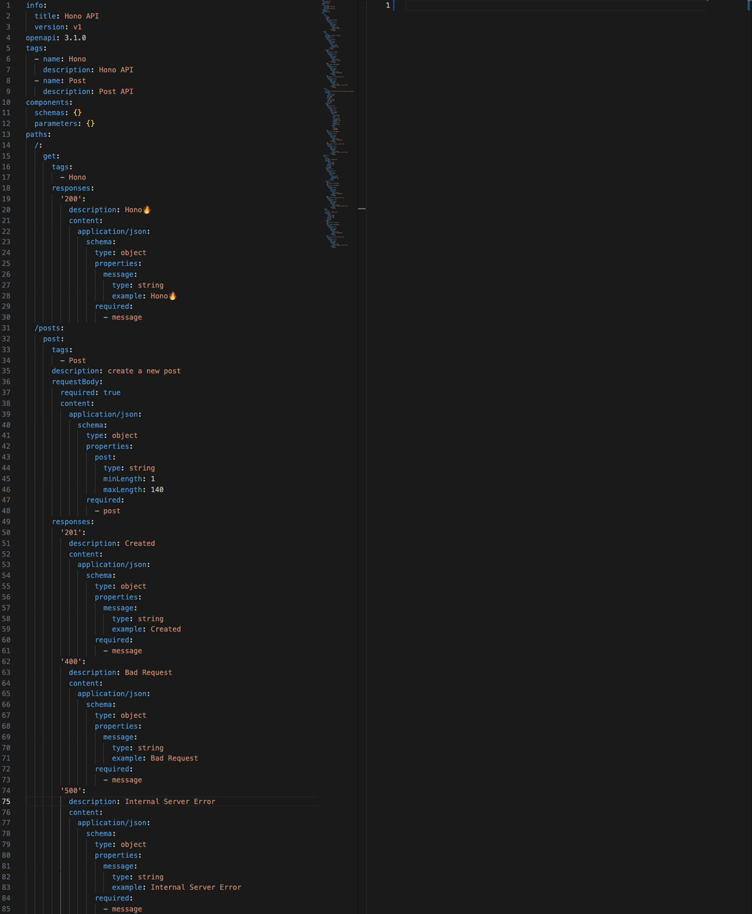

# CORS

* [CORS](https://developer.mozilla.org/ja/docs/Web/HTTP/CORS)

## React

&emsp;`http://localhost:5173/`

:::code-group
```tsx [src/app.tsx]
import React, { useState } from 'react'

const App = () => {
  const [message, setMessage] = useState('')

  const onSubmit = async () => {
    const res = await fetch('http://localhost:3000')
    const data = await res.json()
    setMessage(data.message)
  }

  return (
    <>
      <h1>React CORS</h1>
      <button onClick={onSubmit}>Get Message</button>
      <h1>{message}</h1>
    </>
  )
}

export default App
```
:::

## Express

:::code-group
```ts [src/app/index.ts]
import express from 'express'
import { ExpressHandler } from '../handler/express_handler'
import { PostsHandler } from '../handler/posts_handler'
import cors from 'cors'

export class App {
  static init() {
    const app = express().use(
      cors({
        origin: 'http://localhost:5173',
      }),
    )
    app.use(express.json())
    this.applyHandler(app)
    const defaultPort = 3000
    const port = process.env.PORT !== undefined ? parseInt(process.env.PORT) : defaultPort
    app.listen(port, () => {
      console.log(`Server is running on http://localhost:${port}`)
    })
  }

  static applyHandler(app: express.Application) {
    ExpressHandler.apply(app)
    PostsHandler.apply(app)
  }
}
```
:::

## Demo



## Add `/`

:::code-group
```ts [src/app/index.ts]
...
import cors from 'cors'

export class App {
  static init() {
    const app = express().use(
      cors({
        origin: 'http://localhost:5173', // [!code --]
        origin: 'http://localhost:5173/', // [!code ++]
      }),
    )
    ...
  }
}
```
:::

## Error

:::code-group
```sh
Access to fetch at 'http://localhost:3000/' from origin 'http://localhost:5173' has been blocked by CORS policy: The 'Access-Control-Allow-Origin' header has a value 'http://localhost:5173/' that is not equal to the supplied origin. Have the server send the header with a valid value, or, if an opaque response serves your needs, set the request's mode to 'no-cors' to fetch the resource with CORS disabled.
```
:::

## Hono

:::code-group
```ts [src/app/index.ts]
import { Hono } from 'hono'
import { cors } from 'hono/cors'
import { logger } from 'hono/logger'
import { serve } from '@hono/node-server'
import { HonoHandler } from '../handler/hono_handler'
import { PostsHandler } from '../handler/posts_handler'
import * as dotenv from 'dotenv'

dotenv.config()

export class App {
  static init() {
    const app = new Hono()
    const defaultPort = 3001
    const port = process.env.PORT !== undefined ? parseInt(process.env.PORT) : defaultPort
    console.log(`Server is running on http://localhost:${port}`)
    app.use('*', logger())
    app.use('*', async (c, next) => {
      console.log(`  ::: ${c.req.method} ${c.req.url}`)
      return next()
    })
    app.use('*', async (c, next) => {
      try {
        await next()
      } catch (e) {
        return c.json({ error: (e as Error).message }, 500)
      }
    })
    serve({
      fetch: app.fetch,
      port,
    })
    app.use(
      '/*',
      cors({
        origin: 'http://localhost:5173',
      }),
    )
    return this.applyRoutes(app)
  }

  static applyRoutes(app: Hono) {
    return app.route('/', HonoHandler.apply(app)).route('/', PostsHandler.apply(app))
  }
}
```
:::

## Demo


## Add `/`

:::code-group
```ts [src/app/index.ts]
...
import { cors } from 'hono/cors'
...
export class App {
  static init() {
    const app = new Hono()
    ...
    app.use(
      '/*',
      cors({
        origin: 'http://localhost:5173', // [!code --]
        origin: 'http://localhost:5173/', // [!code ++]
      }),
    )
    ...
  }
  ...
}
```
:::

## Error

:::code-group
```sh
Access to fetch at 'http://localhost:3000/' from origin 'http://localhost:5173' has been blocked by CORS policy: No 'Access-Control-Allow-Origin' header is present on the requested resource. If an opaque response serves your needs, set the request's mode to 'no-cors' to fetch the resource with CORS disabled.
```
:::

## Typesafe

* [Zodios](https://www.zodios.org/)

## BackEnd

:::code-group
```ts [src/api/index.ts]
import { makeApi } from '@zodios/core'
import { z } from 'zod'

const zodiosSchema = z.object({
  message: z.string(),
})

export const zodiosApi = makeApi([
  {
    method: 'get',
    path: '/',
    alias: 'express',
    description: 'zodios',
    response: zodiosSchema,
  },
])
```
:::

:::code-group
```ts [src/index.ts]
import { Zodios } from '@zodios/core'
import { zodiosApi } from './api'

export const zodiosClient = new Zodios('http://localhost:3000', [...zodiosApi])
```
:::

## FrontEnd

:::code-group
```tsx [src/app.tsx]
import React, { useState } from 'react'
import { zodiosClient } from '@packages/zodios'

const api = zodiosClient

const App = () => {
  const [message, setMessage] = useState('')

  const onSubmit = async () => {
    const res = await api.express()
    setMessage(res.message)
  }

  return (
    <>
      <h1>Cors</h1>
      <button onClick={onSubmit}>Get Message</button>
      <h1>{message}</h1>
    </>
  )
}

export default App
```
:::


## Hono RPC

* [RPC](https://hono.dev/docs/guides/rpc)

## BackEnd

:::code-group
```ts [src/handler/hono_handler.ts]
import type { Hono } from 'hono'

export class HonoHandler {
  static apply(app: Hono) {
    return app.get('/', async (c) => {
      return c.json({ message: 'Hono🔥' })
    })
  }
}
```
:::

:::code-group
```ts [src/index.ts]
import { App } from './app'

const app = App.init()
export type AddType = typeof app
export default app
```
:::


## FrontEnd

:::code-group
```tsx [src/app.tsx]
import React, { useState } from 'react'
import { AddType } from '@apps/hono'
import { hc } from 'hono/client'

const api = hc<AddType>('http://localhost:3000')

const App = () => {
  const [message, setMessage] = useState('')

  const onSubmit = async () => {
    const res = await api.index.$get()
    const data = await res.json()
    setMessage(data.message)
  }

  return (
    <>
      <h1>React CORS</h1>
      <button onClick={onSubmit}>Get Message</button>
      <h1>{message}</h1>
    </>
  )
}

export default App
```
:::