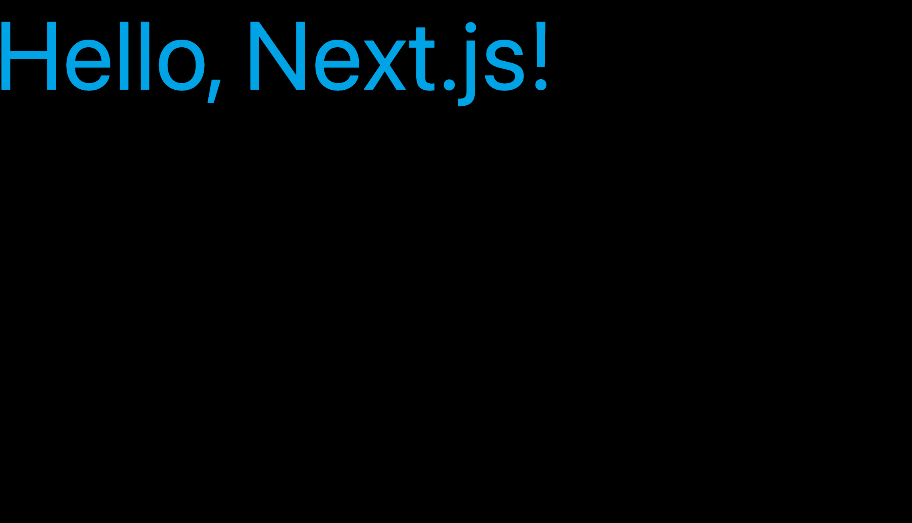

# Next.js

* [Next.js](https://nextjs.org/)

## Directory Structure

```
.
├── app
│   ├── layout.tsx
│   └── page.tsx
├── next-env.d.ts
├── package.json
├── package-lock.json
└── tsconfig.json
```

## Install

:::code-group
```sh [npm]
npm install next@latest react@latest react-dom@latest
```
:::

:::code-group
```sh [npm]
npm install -D @types/node @types/react typescript
```
:::

## package.json
:::code-group
```json [package.json]
{
  "name": "@apps/nextjs",
  "scripts": {
    "dev": "next dev",
    "build": "next build",
    "start": "next start",
    "lint": "next lint"
  },
  "dependencies": {
    "next": "^15.0.3",
    "react": "^18.3.1",
    "react-dom": "^18.3.1"
  },
  "devDependencies": {
    "@types/node": "^22.10.1",
    "@types/react": "^18.3.12",
    "typescript": "^5.7.2"
  }
}
```
:::

## layout

:::code-group
```tsx [app/layout.tsx]
export default function RootLayout({
  children,
}: {
  children: React.ReactNode
}) {
  return (
    <html lang='en'>
      <body>{children}</body>
    </html>
  )
}
```
:::

## page
:::code-group
```tsx [app/page.tsx]
export default function Page() {
  return <h1>Hello, Next.js!</h1>
}
```
:::

## Run
:::code-group
```sh [npm]
npm run dev
```
:::

## Accesse Browser

```
http://localhost:3000/
```


## Tailwind CSS

* [Tailwind CSS](https://tailwindcss.com/)

## Install

:::code-group
```sh [npm]
npm install -D tailwindcss postcss autoprefixer
```
:::

:::code-group
```sh [npm]
npx tailwindcss init -p
```
:::

## Directory Structure
```
.
├── app
│   ├── layout.tsx
│   └── page.tsx
├── next-env.d.ts
├── package.json
├── postcss.config.js
├── styles
│   └── global.css
├── tailwind.config.js
└── tsconfig.json
```


## tailwind.config.js
:::code-group
```js [tailwind.config.js]
/** @type {import('tailwindcss').Config} */
module.exports = {
  content: ['./app/**/*.{js,jsx,ts,tsx}', './pages/**/*.{js,jsx,ts,tsx}', './components/**/*.{js,jsx,ts,tsx}'],
  theme: {
    extend: {},
  },
  plugins: [],
}
```
:::

## global.css

:::code-group
```css [styles/global.css]
@tailwind base;
@tailwind components;
@tailwind utilities;

:root {
  @apply h-full bg-black
}

body {
  @apply h-full bg-black
}
```
:::

## Apply

## layout.tsx

:::code-group
```tsx [app/layout.tsx]
import '../styles/global.css'

export default function RootLayout({
  children,
}: {
  children: React.ReactNode
}) {
  return (
    <html lang='en'>
      <body>{children}</body>
    </html>
  )
}
```
:::

## page.tsx

:::code-group
```tsx [app/page.tsx]
export default function Page() {
  return <h1 className='text-3xl text-sky-500'>Hello, Next.js!</h1>
}
```
:::

## Accesse Browser

```
http://localhost:3000/
```

