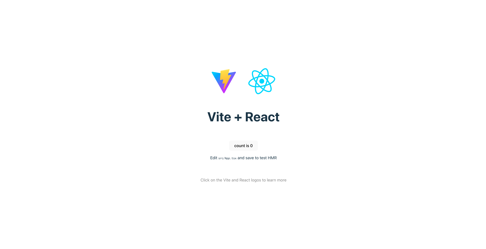

# Bun React

* [Vite](https://ja.vitejs.dev/)

::: code-group
```sh [bun]
bun create vite@latest
```
:::

## Directory Structure
```
./react
|-- eslint.config.js
|-- index.html
|-- package.json
|-- public
|   `-- vite.svg
|-- src
|   |-- App.css
|   |-- App.tsx
|   |-- assets
|   |   `-- react.svg
|   |-- index.css
|   |-- main.tsx
|   `-- vite-env.d.ts
|-- tsconfig.app.json
|-- tsconfig.json
|-- tsconfig.node.json
`-- vite.config.ts
```

::: code-group
```sh
cd react
```
:::

::: code-group
```sh [bun]
bun i
```
:::

::: code-group
```sh [bun]
bun run dev
```
:::

## Accesse Browser
```
http://localhost:5173/
```

