# Yarn Prisma

## Directory Structure
```
.
|-- package.json
|-- prisma
|   |-- dev.db
|   |-- dev.db-journal
|   |-- migrations
|   |   |-- *_init
|   |   |   `-- migration.sql
|   |   `-- migration_lock.toml
|   `-- schema.prisma
|-- src
|   `-- index.ts
`-- tsconfig.json
```

::: code-group
```sh [yarn]
yarn add prisma --dev
```
:::

::: code-group
```sh [yarn]
yarn add @prisma/client
```
:::

::: code-group
```sh [.env]
DATABASE_URL="file:./dev.db"
```
:::


## `schema.prisma`作成
::: code-group
```sh [yarn]
yarn prisma init --datasource-provider sqlite
```
:::

## Migrate
::: code-group
```sh [yarn]
yarn prisma migrate dev --name init
```
:::

::: code-group
```ts [src/index.ts]
import { PrismaClient } from '@prisma/client'

const prisma = new PrismaClient()

const deleteUsers = async () => {
  await prisma.user.deleteMany()
}

deleteUsers()

const createUsers = async () => {
  await prisma.user.createMany({
    data: [
      {
        id: 1,
        name: 'prisma',
        email: 'prisma@email.com',
      },
      {
        id: 2,
        name: 'drizzle',
        email: 'drizzle@email.com',
      },
      {
        id: 3,
        name: 'typeorm',
        email: 'typeorm@email.com',
      },
    ],
  })
}

const main = async () => {
  await createUsers()
  const users = await prisma.user.findMany()
  console.log(users)
}

main()
  .catch((e) => {
    console.error(e)
    process.exit(1)
  })
  .finally(async () => {
    await prisma.$disconnect()
  })

```
:::

## Execution
```
[
  { id: 1, email: 'prisma@email.com', name: 'prisma' },
  { id: 2, email: 'drizzle@email.com', name: 'drizzle' },
  { id: 3, email: 'typeorm@email.com', name: 'typeorm' }
]
```

## Mermaid

* [prisma-erd-generator
](https://github.com/keonik/prisma-erd-generator)

::: code-group
```sh [yarn]
yarn add -D prisma-erd-generator
```
:::

::: code-group
```prisma [prisma/schema.prisma]
generator client {
  provider = "prisma-client-js"
}

datasource db {
  provider = "sqlite"
  url      = env("DATABASE_URL")
}

generator erd {
  provider = "prisma-erd-generator"
  output   = "er.md"
}

model User {
  id        Int        @id @default(autoincrement())
  email     String     @unique
  name      String?
  profile   Profile?
  posts     Post[]
  comments  Comment[]
  roles     UserRole[]
  createdAt DateTime   @default(now())
  updatedAt DateTime   @updatedAt
}

model Profile {
  id     Int     @id @default(autoincrement())
  bio    String?
  userId Int     @unique
  user   User    @relation(fields: [userId], references: [id])
}

model Post {
  id         Int        @id @default(autoincrement())
  title      String
  content    String?
  published  Boolean    @default(false)
  authorId   Int
  author     User       @relation(fields: [authorId], references: [id])
  categories Category[]
  comments   Comment[]
  tags       Tag[]
  createdAt  DateTime   @default(now())
  updatedAt  DateTime   @updatedAt
}

model Comment {
  id        Int      @id @default(autoincrement())
  content   String
  postId    Int
  post      Post     @relation(fields: [postId], references: [id])
  authorId  Int
  author    User     @relation(fields: [authorId], references: [id])
  createdAt DateTime @default(now())
  updatedAt DateTime @updatedAt
}

model Category {
  id    Int    @id @default(autoincrement())
  name  String @unique
  posts Post[]
}

model Tag {
  id    Int    @id @default(autoincrement())
  name  String @unique
  posts Post[]
}

model Role {
  id    Int        @id @default(autoincrement())
  name  String     @unique
  users UserRole[]
}

model UserRole {
  userId Int
  roleId Int
  user   User @relation(fields: [userId], references: [id])
  role   Role @relation(fields: [roleId], references: [id])

  @@id([userId, roleId])
}
```

```mmd [mermaid]
erDiagram

  "User" {
    Int id "🗝️"
    String email 
    String name "❓"
    DateTime createdAt 
    DateTime updatedAt 
    }
  

  "Profile" {
    Int id "🗝️"
    String bio "❓"
    }
  

  "Post" {
    Int id "🗝️"
    String title 
    String content "❓"
    Boolean published 
    DateTime createdAt 
    DateTime updatedAt 
    }
  

  "Comment" {
    Int id "🗝️"
    String content 
    DateTime createdAt 
    DateTime updatedAt 
    }
  

  "Category" {
    Int id "🗝️"
    String name 
    }
  

  "Tag" {
    Int id "🗝️"
    String name 
    }
  

  "Role" {
    Int id "🗝️"
    String name 
    }
  

  "UserRole" {

    }
  
    "User" o{--}o "Profile" : "profile"
    "User" o{--}o "Post" : "posts"
    "User" o{--}o "Comment" : "comments"
    "User" o{--}o "UserRole" : "roles"
    "Profile" o|--|| "User" : "user"
    "Post" o|--|| "User" : "author"
    "Post" o{--}o "Category" : "categories"
    "Post" o{--}o "Comment" : "comments"
    "Post" o{--}o "Tag" : "tags"
    "Comment" o|--|| "Post" : "post"
    "Comment" o|--|| "User" : "author"
    "Category" o{--}o "Post" : "posts"
    "Tag" o{--}o "Post" : "posts"
    "Role" o{--}o "UserRole" : "users"
    "UserRole" o|--|| "User" : "user"
    "UserRole" o|--|| "Role" : "role"
```
:::

## Generate
::: code-group
```sh [yarn]
yarn prisma generate
```
:::



```mermaid
erDiagram

  "User" {
    Int id "🗝️"
    String email 
    String name "❓"
    DateTime createdAt 
    DateTime updatedAt 
    }
  

  "Profile" {
    Int id "🗝️"
    String bio "❓"
    }
  

  "Post" {
    Int id "🗝️"
    String title 
    String content "❓"
    Boolean published 
    DateTime createdAt 
    DateTime updatedAt 
    }
  

  "Comment" {
    Int id "🗝️"
    String content 
    DateTime createdAt 
    DateTime updatedAt 
    }
  

  "Category" {
    Int id "🗝️"
    String name 
    }
  

  "Tag" {
    Int id "🗝️"
    String name 
    }
  

  "Role" {
    Int id "🗝️"
    String name 
    }
  

  "UserRole" {

    }
  
    "User" o{--}o "Profile" : "profile"
    "User" o{--}o "Post" : "posts"
    "User" o{--}o "Comment" : "comments"
    "User" o{--}o "UserRole" : "roles"
    "Profile" o|--|| "User" : "user"
    "Post" o|--|| "User" : "author"
    "Post" o{--}o "Category" : "categories"
    "Post" o{--}o "Comment" : "comments"
    "Post" o{--}o "Tag" : "tags"
    "Comment" o|--|| "Post" : "post"
    "Comment" o|--|| "User" : "author"
    "Category" o{--}o "Post" : "posts"
    "Tag" o{--}o "Post" : "posts"
    "Role" o{--}o "UserRole" : "users"
    "UserRole" o|--|| "User" : "user"
    "UserRole" o|--|| "Role" : "role"
```

## PlantUML

* [prisma-generator-plantuml-erd](https://github.com/dbgso/prisma-generator-plantuml-erd/tree/main/packages/generator)

::: code-group
```sh [yarn]
yarn add -D prisma-generator-plantuml-erd
```
:::

::: code-group
```prisma [prisma/schema.prisma]
// This is your Prisma schema file,
// learn more about it in the docs: https://pris.ly/d/prisma-schema

generator client {
  provider = "prisma-client-js"
}

datasource db {
  provider = "sqlite"
  url      = env("DATABASE_URL")
}

generator erd_plantuml {
  provider                   = "prisma-generator-plantuml-erd"
  output                     = "erd.puml"
  showUniqueKeyLabel         = true
  isShowForeignKeyOnRelation = true
}

model User {
  id        Int        @id @default(autoincrement())
  email     String     @unique
  name      String?
  profile   Profile?
  posts     Post[]
  comments  Comment[]
  roles     UserRole[]
  createdAt DateTime   @default(now())
  updatedAt DateTime   @updatedAt
}

model Profile {
  id     Int     @id @default(autoincrement())
  bio    String?
  userId Int     @unique
  user   User    @relation(fields: [userId], references: [id])
}

model Post {
  id         Int        @id @default(autoincrement())
  title      String
  content    String?
  published  Boolean    @default(false)
  authorId   Int
  author     User       @relation(fields: [authorId], references: [id])
  categories Category[]
  comments   Comment[]
  tags       Tag[]
  createdAt  DateTime   @default(now())
  updatedAt  DateTime   @updatedAt
}

model Comment {
  id        Int      @id @default(autoincrement())
  content   String
  postId    Int
  post      Post     @relation(fields: [postId], references: [id])
  authorId  Int
  author    User     @relation(fields: [authorId], references: [id])
  createdAt DateTime @default(now())
  updatedAt DateTime @updatedAt
}

model Category {
  id    Int    @id @default(autoincrement())
  name  String @unique
  posts Post[]
}

model Tag {
  id    Int    @id @default(autoincrement())
  name  String @unique
  posts Post[]
}

model Role {
  id    Int        @id @default(autoincrement())
  name  String     @unique
  users UserRole[]
}

model UserRole {
  userId Int
  roleId Int
  user   User @relation(fields: [userId], references: [id])
  role   Role @relation(fields: [roleId], references: [id])

  @@id([userId, roleId])
}
```

``` [plantuml]
@startuml erd
skinparam linetype ortho
entity "User" as User {
+ id [PK] : Int 
--
  * email : [UK] String
  name : String
  * createdAt : DateTime
  * updatedAt : DateTime
}

entity "Profile" as Profile {
+ id [PK] : Int 
--
  bio : String
  # userId : [UK] [FK] User
}

entity "Post" as Post {
+ id [PK] : Int 
--
  * title : String
  content : String
  * published : Boolean
  # authorId : [FK] User
  * createdAt : DateTime
  * updatedAt : DateTime
}

entity "Comment" as Comment {
+ id [PK] : Int 
--
  * content : String
  # postId : [FK] Post
  # authorId : [FK] User
  * createdAt : DateTime
  * updatedAt : DateTime
}

entity "Category" as Category {
+ id [PK] : Int 
--
  * name : [UK] String
}

entity "Tag" as Tag {
+ id [PK] : Int 
--
  * name : [UK] String
}

entity "Role" as Role {
+ id [PK] : Int 
--
  * name : [UK] String
}

entity "UserRole" as UserRole {
--
  # userId : [FK] User
  # roleId : [FK] Role
}

' Relations
Profile |o--|| User: userId
Post }o--|| User: authorId
Comment }o--|| Post: postId
Comment }o--|| User: authorId
UserRole }o--|| User: userId
UserRole }o--|| Role: roleId
' ManyToMany Relations
Post }o--o{ Category
Post }o--o{ Tag
' enum relations
@enduml
```
:::

## Generate
::: code-group
```sh [yarn]
yarn prisma generate
```
:::

@startuml erd
skinparam linetype ortho
entity "User" as User {
+ id [PK] : Int 
--
  * email : [UK] String
  name : String
  * createdAt : DateTime
  * updatedAt : DateTime
}

entity "Profile" as Profile {
+ id [PK] : Int 
--
  bio : String
  # userId : [UK] [FK] User
}

entity "Post" as Post {
+ id [PK] : Int 
--
  * title : String
  content : String
  * published : Boolean
  # authorId : [FK] User
  * createdAt : DateTime
  * updatedAt : DateTime
}

entity "Comment" as Comment {
+ id [PK] : Int 
--
  * content : String
  # postId : [FK] Post
  # authorId : [FK] User
  * createdAt : DateTime
  * updatedAt : DateTime
}

entity "Category" as Category {
+ id [PK] : Int 
--
  * name : [UK] String
}

entity "Tag" as Tag {
+ id [PK] : Int 
--
  * name : [UK] String
}

entity "Role" as Role {
+ id [PK] : Int 
--
  * name : [UK] String
}

entity "UserRole" as UserRole {
--
  # userId : [FK] User
  # roleId : [FK] Role
}

' Relations
Profile |o--|| User: userId
Post }o--|| User: authorId
Comment }o--|| Post: postId
Comment }o--|| User: authorId
UserRole }o--|| User: userId
UserRole }o--|| Role: roleId
' ManyToMany Relations
Post }o--o{ Category
Post }o--o{ Tag
' enum relations
@enduml

## Md
::: code-group
```prisma [prisma/schema.prisma]
// This is your Prisma schema file,
// learn more about it in the docs: https://pris.ly/d/prisma-schema

generator client {
  provider = "prisma-client-js"
}

datasource db {
  provider = "sqlite"
  url      = env("DATABASE_URL")
}

generator erd {
  provider = "prisma-erd-generator"
  output   = "er.md"
}

generator erd_plantuml {
  provider                   = "prisma-generator-plantuml-erd"
  exportPerTables            = true
  showUniqueKeyLabel         = true
  isShowForeignKeyOnRelation = true
  markdownOutput             = "./example-tables.md"
  markdownIncludeERD         = true
}

model User {
  id        Int        @id @default(autoincrement())
  email     String     @unique
  name      String?
  profile   Profile?
  posts     Post[]
  comments  Comment[]
  roles     UserRole[]
  createdAt DateTime   @default(now())
  updatedAt DateTime   @updatedAt
}

model Profile {
  id     Int     @id @default(autoincrement())
  bio    String?
  userId Int     @unique
  user   User    @relation(fields: [userId], references: [id])
}

model Post {
  id         Int        @id @default(autoincrement())
  title      String
  content    String?
  published  Boolean    @default(false)
  authorId   Int
  author     User       @relation(fields: [authorId], references: [id])
  categories Category[]
  comments   Comment[]
  tags       Tag[]
  createdAt  DateTime   @default(now())
  updatedAt  DateTime   @updatedAt
}

model Comment {
  id        Int      @id @default(autoincrement())
  content   String
  postId    Int
  post      Post     @relation(fields: [postId], references: [id])
  authorId  Int
  author    User     @relation(fields: [authorId], references: [id])
  createdAt DateTime @default(now())
  updatedAt DateTime @updatedAt
}

model Category {
  id    Int    @id @default(autoincrement())
  name  String @unique
  posts Post[]
}

model Tag {
  id    Int    @id @default(autoincrement())
  name  String @unique
  posts Post[]
}

model Role {
  id    Int        @id @default(autoincrement())
  name  String     @unique
  users UserRole[]
}

model UserRole {
  userId Int
  roleId Int
  user   User @relation(fields: [userId], references: [id])
  role   Role @relation(fields: [roleId], references: [id])

  @@id([userId, roleId])
}
```
:::

## Generate
::: code-group
```sh [yarn]
yarn prisma generate
```
:::

::: details Generated Md
# Tables
- [User](#user)
- [Profile](#profile)
- [Post](#post)
- [Comment](#comment)
- [Category](#category)
- [Tag](#tag)
- [Role](#role)
- [UserRole](#userrole)

# ER diagram
```
@startuml erd
skinparam linetype ortho
entity "User" as User {
+ id [PK] : Int 
--
  * email : [UK] String
  name : String
  * createdAt : DateTime
  * updatedAt : DateTime
}

entity "Profile" as Profile {
+ id [PK] : Int 
--
  bio : String
  # userId : [UK] [FK] User
}

entity "Post" as Post {
+ id [PK] : Int 
--
  * title : String
  content : String
  * published : Boolean
  # authorId : [FK] User
  * createdAt : DateTime
  * updatedAt : DateTime
}

entity "Comment" as Comment {
+ id [PK] : Int 
--
  * content : String
  # postId : [FK] Post
  # authorId : [FK] User
  * createdAt : DateTime
  * updatedAt : DateTime
}

entity "Category" as Category {
+ id [PK] : Int 
--
  * name : [UK] String
}

entity "Tag" as Tag {
+ id [PK] : Int 
--
  * name : [UK] String
}

entity "Role" as Role {
+ id [PK] : Int 
--
  * name : [UK] String
}

entity "UserRole" as UserRole {
--
  # userId : [FK] User
  # roleId : [FK] Role
}

' Relations
Profile |o--|| User: userId
Post }o--|| User: authorId
Comment }o--|| Post: postId
Comment }o--|| User: authorId
UserRole }o--|| User: userId
UserRole }o--|| Role: roleId
' ManyToMany Relations
Post }o--o{ Category
Post }o--o{ Tag
' enum relations
@enduml
```
# User

## Description


## Columns

|Name | Type | Default | Nullable | Unique | Children | Parent | Comment|
|--- | --- | --- | --- | --- | --- | --- | ---|
|id | Int | autoincrement | false | true | [Profile](#profile), [Post](#post), [Comment](#comment), [UserRole](#userrole) |  | |
|email | String |  | false | true |  |  | |
|name | String |  | true | false |  |  | |
|createdAt | DateTime | now | false | false |  |  | |
|updatedAt | DateTime |  | false | false |  |  | |

## ER diagram

```
@startuml User
skinparam linetype ortho
entity "User" as User {
+ id [PK] : Int 
--
  * email : [UK] String
  name : String
  * createdAt : DateTime
  * updatedAt : DateTime
}

entity "Profile" as Profile {
+ id [PK] : Int 
--
  bio : String
  # userId : [UK] [FK] User
}

entity "Post" as Post {
+ id [PK] : Int 
--
  * title : String
  content : String
  * published : Boolean
  # authorId : [FK] User
  * createdAt : DateTime
  * updatedAt : DateTime
}

entity "Comment" as Comment {
+ id [PK] : Int 
--
  * content : String
  # postId : [FK] Post
  # authorId : [FK] User
  * createdAt : DateTime
  * updatedAt : DateTime
}

entity "UserRole" as UserRole {
--
  # userId : [FK] User
  # roleId : [FK] Role
}

' Relations
Profile |o--|| User: userId
Post }o--|| User: authorId
Comment }o--|| Post: postId
Comment }o--|| User: authorId
UserRole }o--|| User: userId
' ManyToMany Relations
' enum relations
@enduml
```
# Profile

## Description


## Columns

|Name | Type | Default | Nullable | Unique | Children | Parent | Comment|
|--- | --- | --- | --- | --- | --- | --- | ---|
|id | Int | autoincrement | false | true |  |  | |
|bio | String |  | true | false |  |  | |
|userId | Int |  | false | true |  | [User](#user) | |

## ER diagram

```
@startuml Profile
skinparam linetype ortho
entity "User" as User {
+ id [PK] : Int 
--
  * email : [UK] String
  name : String
  * createdAt : DateTime
  * updatedAt : DateTime
}

entity "Profile" as Profile {
+ id [PK] : Int 
--
  bio : String
  # userId : [UK] [FK] User
}

' Relations
Profile |o--|| User: userId
' ManyToMany Relations
' enum relations
@enduml
```
# Post

## Description


## Columns

|Name | Type | Default | Nullable | Unique | Children | Parent | Comment|
|--- | --- | --- | --- | --- | --- | --- | ---|
|id | Int | autoincrement | false | true | [Comment](#comment) |  | |
|title | String |  | false | false |  |  | |
|content | String |  | true | false |  |  | |
|published | Boolean |  | false | false |  |  | |
|authorId | Int |  | false | false |  | [User](#user) | |
|createdAt | DateTime | now | false | false |  |  | |
|updatedAt | DateTime |  | false | false |  |  | |

## ER diagram

```
@startuml Post
skinparam linetype ortho
entity "User" as User {
+ id [PK] : Int 
--
  * email : [UK] String
  name : String
  * createdAt : DateTime
  * updatedAt : DateTime
}

entity "Post" as Post {
+ id [PK] : Int 
--
  * title : String
  content : String
  * published : Boolean
  # authorId : [FK] User
  * createdAt : DateTime
  * updatedAt : DateTime
}

entity "Comment" as Comment {
+ id [PK] : Int 
--
  * content : String
  # postId : [FK] Post
  # authorId : [FK] User
  * createdAt : DateTime
  * updatedAt : DateTime
}

entity "Category" as Category {
+ id [PK] : Int 
--
  * name : [UK] String
}

entity "Tag" as Tag {
+ id [PK] : Int 
--
  * name : [UK] String
}

' Relations
Post }o--|| User: authorId
Comment }o--|| Post: postId
Comment }o--|| User: authorId
' ManyToMany Relations
Post }o--o{ Category
Post }o--o{ Tag
' enum relations
@enduml
```
# Comment

## Description


## Columns

|Name | Type | Default | Nullable | Unique | Children | Parent | Comment|
|--- | --- | --- | --- | --- | --- | --- | ---|
|id | Int | autoincrement | false | true |  |  | |
|content | String |  | false | false |  |  | |
|postId | Int |  | false | false |  | [Post](#post) | |
|authorId | Int |  | false | false |  | [User](#user) | |
|createdAt | DateTime | now | false | false |  |  | |
|updatedAt | DateTime |  | false | false |  |  | |

## ER diagram

```
@startuml Comment
skinparam linetype ortho
entity "User" as User {
+ id [PK] : Int 
--
  * email : [UK] String
  name : String
  * createdAt : DateTime
  * updatedAt : DateTime
}

entity "Post" as Post {
+ id [PK] : Int 
--
  * title : String
  content : String
  * published : Boolean
  # authorId : [FK] User
  * createdAt : DateTime
  * updatedAt : DateTime
}

entity "Comment" as Comment {
+ id [PK] : Int 
--
  * content : String
  # postId : [FK] Post
  # authorId : [FK] User
  * createdAt : DateTime
  * updatedAt : DateTime
}

' Relations
Post }o--|| User: authorId
Comment }o--|| Post: postId
Comment }o--|| User: authorId
' ManyToMany Relations
' enum relations
@enduml
```
# Category

## Description


## Columns

|Name | Type | Default | Nullable | Unique | Children | Parent | Comment|
|--- | --- | --- | --- | --- | --- | --- | ---|
|id | Int | autoincrement | false | true |  |  | |
|name | String |  | false | true |  |  | |

## ER diagram

```
@startuml Category
skinparam linetype ortho
entity "Post" as Post {
+ id [PK] : Int 
--
  * title : String
  content : String
  * published : Boolean
  # authorId : [FK] User
  * createdAt : DateTime
  * updatedAt : DateTime
}

entity "Category" as Category {
+ id [PK] : Int 
--
  * name : [UK] String
}

' Relations
' ManyToMany Relations
Post }o--o{ Category
' enum relations
@enduml
```
# Tag

## Description


## Columns

|Name | Type | Default | Nullable | Unique | Children | Parent | Comment|
|--- | --- | --- | --- | --- | --- | --- | ---|
|id | Int | autoincrement | false | true |  |  | |
|name | String |  | false | true |  |  | |

## ER diagram

```
@startuml Tag
skinparam linetype ortho
entity "Post" as Post {
+ id [PK] : Int 
--
  * title : String
  content : String
  * published : Boolean
  # authorId : [FK] User
  * createdAt : DateTime
  * updatedAt : DateTime
}

entity "Tag" as Tag {
+ id [PK] : Int 
--
  * name : [UK] String
}

' Relations
' ManyToMany Relations
Post }o--o{ Tag
' enum relations
@enduml
```
# Role

## Description


## Columns

|Name | Type | Default | Nullable | Unique | Children | Parent | Comment|
|--- | --- | --- | --- | --- | --- | --- | ---|
|id | Int | autoincrement | false | true | [UserRole](#userrole) |  | |
|name | String |  | false | true |  |  | |

## ER diagram

```
@startuml Role
skinparam linetype ortho
entity "Role" as Role {
+ id [PK] : Int 
--
  * name : [UK] String
}

entity "UserRole" as UserRole {
--
  # userId : [FK] User
  # roleId : [FK] Role
}

' Relations
UserRole }o--|| Role: roleId
' ManyToMany Relations
' enum relations
@enduml
```
# UserRole

## Description


## Columns

|Name | Type | Default | Nullable | Unique | Children | Parent | Comment|
|--- | --- | --- | --- | --- | --- | --- | ---|
|userId | Int |  | false | false |  | [User](#user) | |
|roleId | Int |  | false | false |  | [Role](#role) | |

## ER diagram

```
@startuml UserRole
skinparam linetype ortho
entity "User" as User {
+ id [PK] : Int 
--
  * email : [UK] String
  name : String
  * createdAt : DateTime
  * updatedAt : DateTime
}

entity "Role" as Role {
+ id [PK] : Int 
--
  * name : [UK] String
}

entity "UserRole" as UserRole {
--
  # userId : [FK] User
  # roleId : [FK] Role
}

' Relations
UserRole }o--|| User: userId
UserRole }o--|| Role: roleId
' ManyToMany Relations
' enum relations
@enduml
```
:::

## Options

### exportPerTables
&emsp;各テーブルが出力される。デフォルト値は`false`。

### showUniqueKeyLabel 
&emsp;`ER`図上で一意のキーとしてもラベル付けされる`[UK]`。デフォルト値は`false`。

### lineType

* ortho
* polyline
* unset

デフォルト値は`ortho`。

### isLeftToRightDirection

&emsp;`true`にすると、`PlantUML`が`left to right direction`指定される。

### lineLength
&emsp;線の長さを変更できる。デフォルト値は`--`。