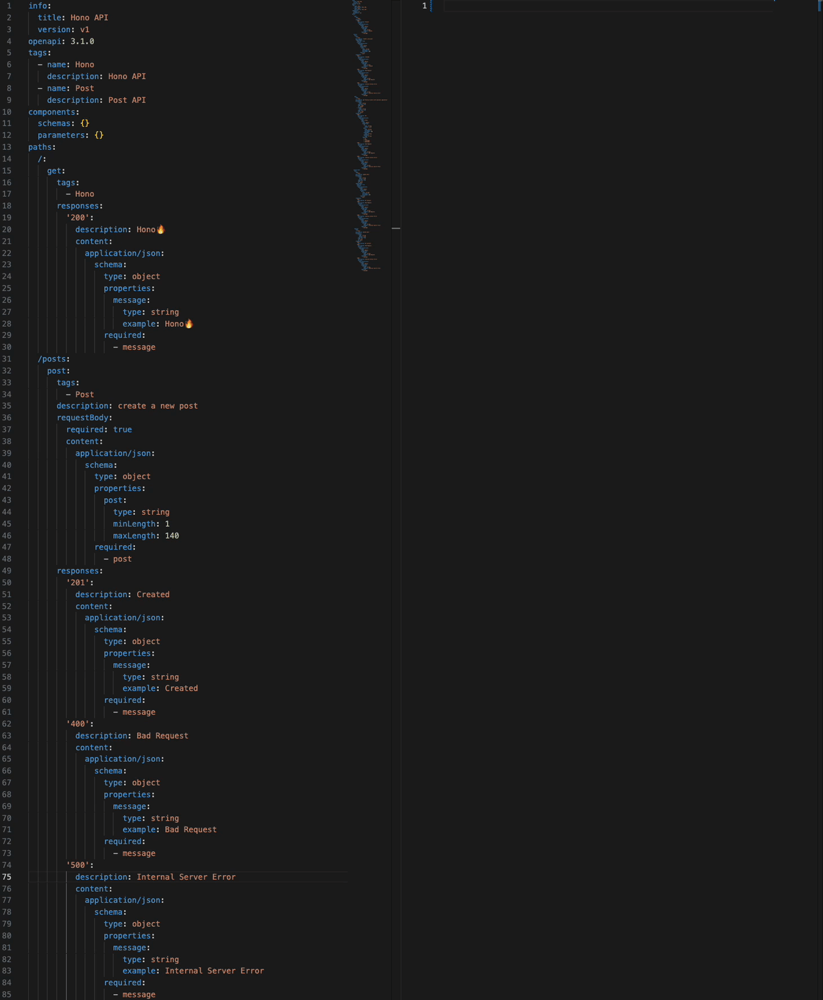

# Zodios Hono

* [openapi-zod-client](https://github.com/astahmer/openapi-zod-client)

* [How to use openapi-zod-client](/posts/2024/48.html)

## OpenAPI
:::details openapi.yaml
:::code-group
```yaml [openapi.yaml]
info:
  title: Hono API
  version: v1
openapi: 3.1.0
tags:
  - name: Hono
    description: Hono API
  - name: Post
    description: Post API
components:
  schemas: {}
  parameters: {}
paths:
  /:
    get:
      tags:
        - Hono
      responses:
        '200':
          description: Hono🔥
          content:
            application/json:
              schema:
                type: object
                properties:
                  message:
                    type: string
                    example: Hono🔥
                required:
                  - message
  /posts:
    post:
      tags:
        - Post
      description: create a new post
      requestBody:
        required: true
        content:
          application/json:
            schema:
              type: object
              properties:
                post:
                  type: string
                  minLength: 1
                  maxLength: 140
              required:
                - post
      responses:
        '201':
          description: Created
          content:
            application/json:
              schema:
                type: object
                properties:
                  message:
                    type: string
                    example: Created
                required:
                  - message
        '400':
          description: Bad Request
          content:
            application/json:
              schema:
                type: object
                properties:
                  message:
                    type: string
                    example: Bad Request
                required:
                  - message
        '500':
          description: Internal Server Error
          content:
            application/json:
              schema:
                type: object
                properties:
                  message:
                    type: string
                    example: Internal Server Error
                required:
                  - message
    get:
      tags:
        - Post
      description: get PostList posts with optional pagination
      parameters:
        - schema:
            type: string
          required: true
          name: page
          in: query
        - schema:
            type: string
          required: true
          name: rows
          in: query
      responses:
        '200':
          description: OK
          content:
            application/json:
              schema:
                type: array
                items:
                  type: object
                  properties:
                    id:
                      type: string
                      format: uuid
                    post:
                      type: string
                      minLength: 1
                      maxLength: 140
                    createdAt:
                      type: string
                    updatedAt:
                      type: string
                  required:
                    - id
                    - post
                    - createdAt
                    - updatedAt
        '400':
          description: Bad Request
          content:
            application/json:
              schema:
                type: object
                properties:
                  message:
                    type: string
                    example: Bad Request
                required:
                  - message
        '500':
          description: Internal Server Error
          content:
            application/json:
              schema:
                type: object
                properties:
                  message:
                    type: string
                    example: Internal Server Error
                required:
                  - message
  /posts/{id}:
    put:
      tags:
        - Post
      description: update Post
      parameters:
        - schema:
            type: string
            format: uuid
          required: true
          name: id
          in: path
      requestBody:
        required: true
        content:
          application/json:
            schema:
              type: object
              properties:
                post:
                  type: string
                  minLength: 1
                  maxLength: 140
              required:
                - post
      responses:
        '204':
          description: No Content
        '400':
          description: Bad Request
          content:
            application/json:
              schema:
                type: object
                properties:
                  message:
                    type: string
                    example: Bad Request
                required:
                  - message
        '500':
          description: Internal Server Error
          content:
            application/json:
              schema:
                type: object
                properties:
                  message:
                    type: string
                    example: Internal Server Error
                required:
                  - message
    delete:
      tags:
        - Post
      description: delete post
      parameters:
        - schema:
            type: string
            format: uuid
          required: true
          name: id
          in: path
      responses:
        '204':
          description: No Content
        '400':
          description: Bad Request
          content:
            application/json:
              schema:
                type: object
                properties:
                  message:
                    type: string
                    example: Bad Request
                required:
                  - message
        '500':
          description: Internal Server Error
          content:
            application/json:
              schema:
                type: object
                properties:
                  message:
                    type: string
                    example: Internal Server Error
                required:
                  - message
```
:::

## Generate Code

:::details index.ts
:::code-group
```ts [index.ts]
import { makeApi, Zodios, type ZodiosOptions } from '@zodios/core'
import { z } from 'zod'

const endpoints = makeApi([
  {
    method: 'get',
    path: '/',
    alias: 'get',
    requestFormat: 'json',
    response: z.object({ message: z.string() }).passthrough(),
  },
  {
    method: 'post',
    path: '/posts',
    alias: 'postPosts',
    description: `create a new post`,
    requestFormat: 'json',
    parameters: [
      {
        name: 'body',
        type: 'Body',
        schema: z.object({ post: z.string().min(1).max(140) }).passthrough(),
      },
    ],
    response: z.object({ message: z.string() }).passthrough(),
    errors: [
      {
        status: 400,
        description: `Bad Request`,
        schema: z.object({ message: z.string() }).passthrough(),
      },
      {
        status: 500,
        description: `Internal Server Error`,
        schema: z.object({ message: z.string() }).passthrough(),
      },
    ],
  },
  {
    method: 'get',
    path: '/posts',
    alias: 'getPosts',
    description: `get PostList posts with optional pagination`,
    requestFormat: 'json',
    parameters: [
      {
        name: 'page',
        type: 'Query',
        schema: z.string(),
      },
      {
        name: 'rows',
        type: 'Query',
        schema: z.string(),
      },
    ],
    response: z.array(
      z
        .object({
          id: z.string().uuid(),
          post: z.string().min(1).max(140),
          createdAt: z.string(),
          updatedAt: z.string(),
        })
        .passthrough(),
    ),
    errors: [
      {
        status: 400,
        description: `Bad Request`,
        schema: z.object({ message: z.string() }).passthrough(),
      },
      {
        status: 500,
        description: `Internal Server Error`,
        schema: z.object({ message: z.string() }).passthrough(),
      },
    ],
  },
  {
    method: 'put',
    path: '/posts/:id',
    alias: 'putPostsId',
    description: `update Post`,
    requestFormat: 'json',
    parameters: [
      {
        name: 'body',
        type: 'Body',
        schema: z.object({ post: z.string().min(1).max(140) }).passthrough(),
      },
      {
        name: 'id',
        type: 'Path',
        schema: z.string().uuid(),
      },
    ],
    response: z.void(),
    errors: [
      {
        status: 400,
        description: `Bad Request`,
        schema: z.object({ message: z.string() }).passthrough(),
      },
      {
        status: 500,
        description: `Internal Server Error`,
        schema: z.object({ message: z.string() }).passthrough(),
      },
    ],
  },
  {
    method: 'delete',
    path: '/posts/:id',
    alias: 'deletePostsId',
    description: `delete post`,
    requestFormat: 'json',
    parameters: [
      {
        name: 'id',
        type: 'Path',
        schema: z.string().uuid(),
      },
    ],
    response: z.void(),
    errors: [
      {
        status: 400,
        description: `Bad Request`,
        schema: z.object({ message: z.string() }).passthrough(),
      },
      {
        status: 500,
        description: `Internal Server Error`,
        schema: z.object({ message: z.string() }).passthrough(),
      },
    ],
  },
])

export const api = new Zodios(endpoints)

export function createApiClient(baseUrl: string, options?: ZodiosOptions) {
  return new Zodios(baseUrl, endpoints, options)
}
```
:::

## Hono REST API

&emsp;[Zod Validator Middleware](https://hono.dev/docs/guides/validation#zod-validator-middleware)

:::code-group
```ts [apps/hono/src/handler/posts_handler.ts]
import type { Hono } from 'hono'
import { zValidator } from '@hono/zod-validator'
import { z } from 'zod'
import { Post } from '@packages/prisma'
import { PostsService } from '@packages/service'

export class PostsHandler {
  static apply(app: Hono) {
    return app
      .post('/posts', zValidator('json', z.object({ post: z.string().min(1).max(140) })), async (c) => {
        const { post } = c.req.valid('json')
        await PostsService.postPosts(post)
        return c.json({ message: 'Created' }, 201)
      })
      .get('/posts', zValidator('query', z.object({ page: z.string(), rows: z.string() })), async (c) => {
        const { page, rows } = c.req.valid('query')
        const pageNumber = parseInt(page)
        const rowsPerPage = parseInt(rows)
        if (isNaN(pageNumber) || isNaN(rowsPerPage) || pageNumber < 1 || rowsPerPage < 1) {
          return c.json({ message: 'Bad Request' }, 400)
        }
        const limit = rowsPerPage
        const offset = (pageNumber - 1) * rowsPerPage
        const posts: Post[] = await PostsService.getPosts(limit, offset)
        return c.json(posts, 200)
      })
      .put(
        '/posts/:id',
        zValidator('param', z.object({ id: z.string().uuid() })),
        zValidator('json', z.object({ post: z.string().min(1).max(140) })),
        async (c) => {
          const { id } = c.req.valid('param')
          const { post } = c.req.valid('json')
          await PostsService.putPostsId(id, post)
          return new Response(null, { status: 204 })
        },
      )
      .delete('/posts/:id', zValidator('param', z.object({ id: z.string().uuid() })), async (c) => {
        const { id } = c.req.valid('param')
        await PostsService.deletePostsId(id)
        return new Response(null, { status: 204 })
      })
  }
}
```
:::

## Test

:::code-group
```ts [apps/hono/src/test/api.test.ts]
import { beforeEach, describe, expect, it } from 'vitest'
import { createApiClient } from '@packages/zod-client'
import { prisma, Post } from '@packages/prisma'
import { App } from '../app'
import { randomUUID } from 'crypto'

App.init()

const test = createApiClient('http://localhost:3000')

describe('Zodios Hono🔥 Test', () => {
  beforeEach(async () => {
    await prisma.post.deleteMany()
  })

  it('Hono API', async () => {
    const input = await test.get()

    expect(input).toEqual({
      message: 'Zodios Hono🔥',
    })
  })

  it('postPosts', async () => {
    const input = await test.postPosts({
      post: 'Zodios Hono🔥',
    })

    expect(input).toEqual({ message: 'Created' })
  })

  it('getPosts', async () => {
    const generatePosts = (count: number) => {
      return Array.from({ length: count }, (_, i) => ({
        id: randomUUID(),
        post: `Zodios Hono🔥${i + 1}`,
        createdAt: new Date(`2021-01-${i + 1}`),
        updatedAt: new Date(`2021-01-${i + 1}`),
      }))
    }

    const postDatas = await Promise.all(
      generatePosts(20).map(async (data) => {
        return prisma.post.create({
          data,
        })
      }),
    )

    const input: Post[] = await test.getPosts({
      queries: {
        page: '1',
        rows: '10',
      },
    })

    const expected = postDatas
      .sort((a, b) => new Date(b.createdAt).getTime() - new Date(a.createdAt).getTime())
      .slice(0, 10)
      .map((data) => ({
        ...data,
        createdAt: data.createdAt.toISOString(),
        updatedAt: data.updatedAt.toISOString(),
      }))

    expect(input).toEqual(expected)
  })

  it('putPostsId', async () => {
    const post = await prisma.post.create({
      data: {
        id: randomUUID(),
        post: 'Zodios Hono🔥 Update',
      },
    })

    const updateData = { post: 'Zodios Hono🔥🔥🔥 Update' }
    await test.putPostsId(updateData, {
      params: {
        id: post.id,
      },
    })

    const updatedPost = await prisma.post.findUnique({
      where: {
        id: post.id,
      },
    })

    expect(updatedPost?.post).toEqual('Zodios Hono🔥🔥🔥 Update')
  })

  it('deletePostsId', async () => {
    const post = await prisma.post.create({
      data: {
        id: randomUUID(),
        post: 'Zodios Hono🔥 Delete',
      },
    })

    await test.deletePostsId(undefined, {
      params: {
        id: post.id,
      },
    })

    const deletedPost = await prisma.post.findUnique({
      where: {
        id: post.id,
      },
    })

    expect(deletedPost).toBeNull()
  })
})
```
:::

## I want to use it with Hono RPC

&emsp;[openapi-zod-client](https://github.com/astahmer/openapi-zod-client)のような機能を、[Hono](https://hono.dev/)の[RPC](https://hono.dev/docs/guides/rpc)でも、使いたいと思い、個人的に開発中。

