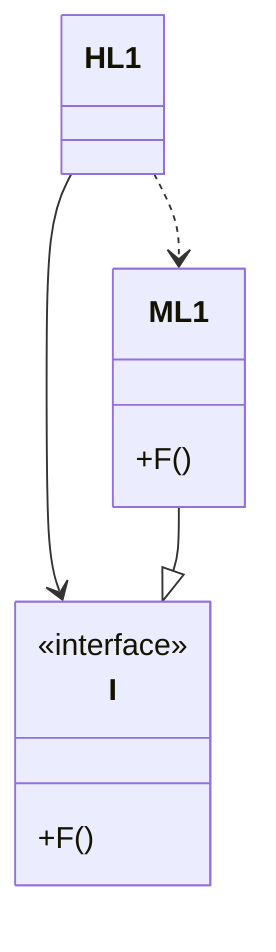

# Clean Architecture オブジェクト指向プログラミング

* カプセル化

* 継承

* ポリモーフィズム

## カプセル化

&emsp;「データ(状態)」と「そのデータを操作するメソッド(振る舞い)」を一つの単位(クラス)にまとめて、外部から不必要にアクセスできないようにする仕組み。

## 継承

&emsp;継承は、既存のクラス(親クラス・スーパークラス)から、その機能や性質を引き継いだ新しいクラス(子クラス・サブクラス)を作る仕組み。

## ポリモーフィズム

&emsp;ポリモーフィズムは、同じメソッド名でも、異なる動作を実行できる性質のこと。

## 依存関係逆転

&emsp;「上位モジュール(ビジネスロジック)が下位モジュール(詳細実装)に依存するのではなく、
どちらも抽象(インターフェース)に依存すべきである」という原則。

## 依存関係逆転

&emsp;モジュール`HL1`がモジュール`ML1`にある`F()`関数を呼び出している。インターフェイス経由で関数を呼び出しているところが、ソースコードの仕掛け。実行時には、インターフェイスには存在しない。`HL1`は`ML1`にある`F()`を呼び出すだけ。

&emsp;`ML1`とインターフェイス`I`のソースコードの依存関係(継承関係)が、制御の流れと逆転していることに注目。これは**依存関係逆転**と呼ばれ、ソフトウェアアーキテクトに大きな影響を与えるもの。

&emsp;オブジェクト指向言語が安全で便利なポリモーフィズムを提供しているというのは、**ソースコードの依存関係は(たとえどこにあっても)逆転できる**事を意味する。

&emsp;このアプローチを使用することで、オブジェクト指向で書かれたシステムに取り組んでいるソフトウェアアーキテクトは、システムにあるすべてのソースコードの依存関係の方向を**絶対的に制御**可能。依存関係を制御の流れに合わせる必要はない。どのモジュールが呼び出しを行い、どのモジュールが呼び出されようとも、ソフトウェアアーキテクトはソースコードの依存関係をどの方向にも向けることができる。

&emsp;システムのソースコードの依存関係を並び替えるだけで、他の方法を使わなくても、データベースとユーザーインターフェイス(UI)をビジネスルールに依存させることが可能。

## データベースとユーザーインターフェイスはビジネスルールに依存

&emsp;UIとデータベースをビジネスルールのプラグインにできる。ビジネスルールのソースコードからUIやデータベースに言及することはない。

&emsp;結果として、ソースコードと同じ依存関係のまま、ビジネスルール、UI、データベースを3つの異なるコンポーネントやデプロイメントユニットにまとめることが可能。ビジネスルールを含むコンポーネントは、UIやデータベースを含むコンポーネントに依存しない。

&emsp;ビジネスルールは、UIやデータベースとは**独立してデプロイ**可能。UIやデータベースに対する変更が、ビジネスルールに影響を与えることはない。これらのコンポーネントはビジネスルールとは関係なく、独立してデプロイできるため。

## 独立デプロイ可能性
&emsp;コンポーネントのソースコードを変更しても、そのコンポーネントだけ再デプロイすればいい。

## 独立開発可能性

&emsp;システムにあるモジュールを個別にデプロイできるなら、別々のチームが個別に開発可能。

## まとめ

&emsp;オブジェクト指向とは、「ポリモーフィズムを使用することで、システムにあるすべてのソースコードの依存関係を絶対的に制御する能力」。

&emsp;これにより、アーキテクトは「プラグインアーキテクチャ」を作成可能。これは、上位レベルの方針を含んだモジュールを下位レベルの詳細を含んだモジュールから独立させること。下位レベルの詳細はプラグインモジュールとなり、上位レベルの方針を含んだモジュールとは独立して、デプロイおよび開発することが可能。