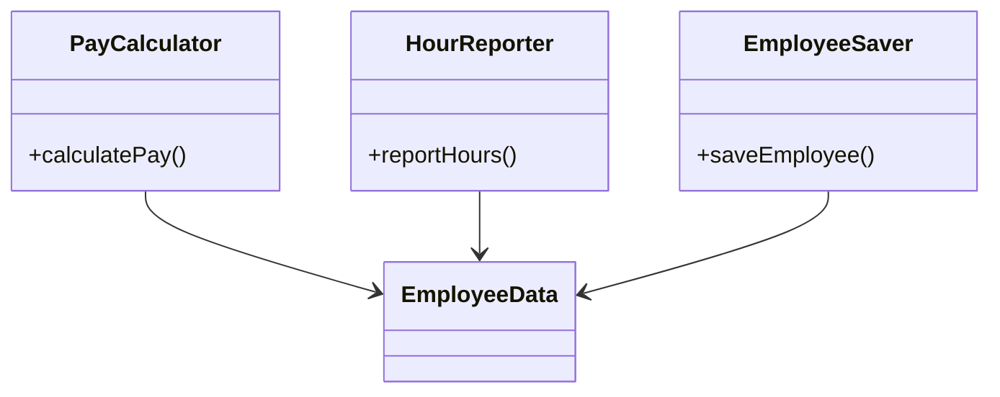
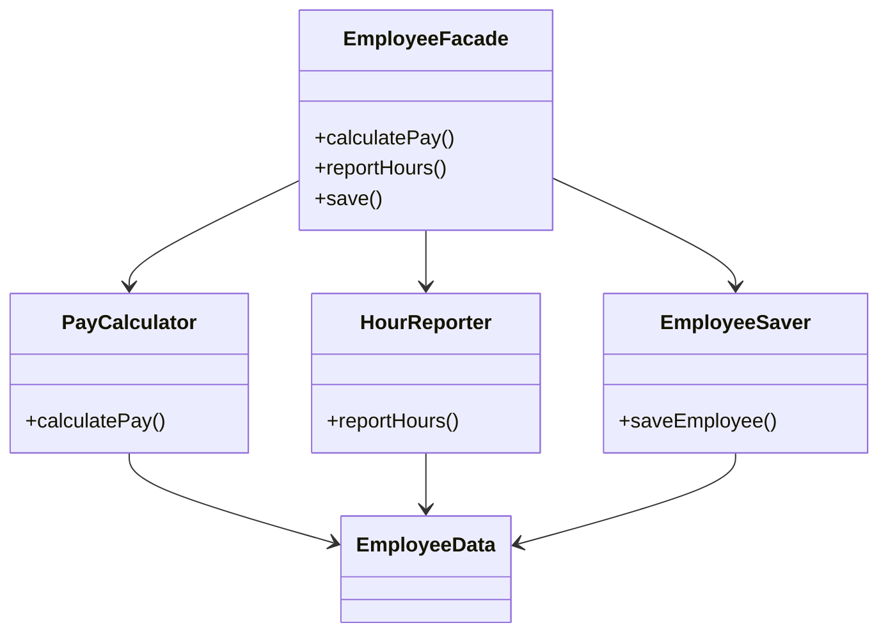
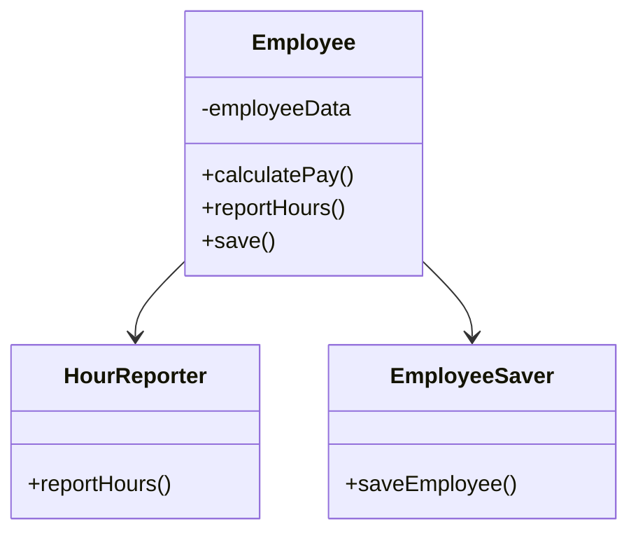

# Clean Architecture 単一責任の原則

&emsp;複数のユーザーやステークホルダーがシステムを同じように変更したいと考えることもある。変更を望む人たちを一まとめにしたグループとして扱い。このグループのことをアクターと呼ぶことにする。

* モジュールはたったひとつのアクターに対して責務を負うべきである。

&emsp;ここでいう「モジュール」は、ソースファイルのこと。

* アクターの異なるコードは分割するべき

## 解決策

* 想定外の重複

* マージ

&emsp;関数を別のクラスに移動する。

&emsp;データを関数から切り離す。3つのクラスから`EmployeeData`クラスを使うようにする。このクラスは、シンプルなデータ構造を持つだけで、メソッドはひとつも含まれていない。3つのクラスはそれぞれ、特定の機能に必要なソースコードだけを保持。また、他のクラスについて知ることは許可されていない。こうしておけば、想定外の重複は避けられる。

## 3つのクラスはお互い相手のことを知らない

&emsp;この弱点は、3つのクラスをインスタンス化しt、追跡しなければいけない。このジレンマを解決するために一般的に使われるのが、**Facade**パターン。

## Facadeパターン

`EmployeeFacade`に含まれるコードはごくわずか。その責務は、実行したいメソッドを持つクラスのインスタンスを生成して、処理を委譲するだけ。
&emsp;重要なビジネスルールはデータの近くにおいておきたい場合。その場合、元の`Employee`クラスに重要なメソッドだけを残し、重要ではないメソッドを呼び出す**Facade**として使えば良い。

## 元の`Employee`クラスに重要なメソッドだけを残し、重要ではないメソッドの**Facade**として使う

