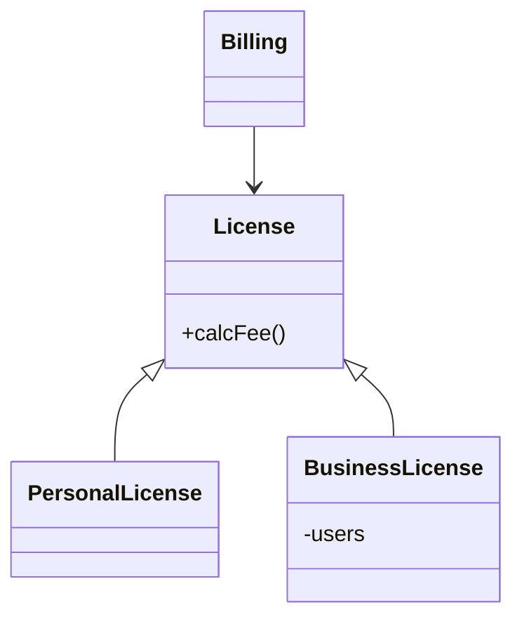
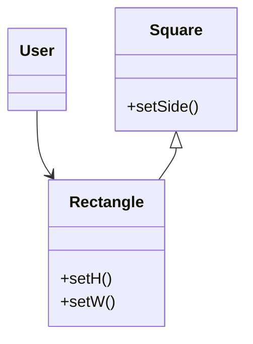

インターフェイス分離の原則

# Clean Architecture リスコフの置換原則

* S型のオブジェクトo1の各々に、対応するT型のオブジェクトo2が1つ存在し、Tを使用して定義されたプログラムPに対してo2の代わりにo1を使用してPの振る舞いが変わらない場合、SはTの派生型であると言える。

## 継承の使い方

&emsp;`License`クラスには`calcFee()`メソッドがあり、`Billing`アプリケーションから呼ばれている。また、`License`の「派生型」が2つある。`PersonalLicense`と`BusinessLicense`。それぞれ異なるアルゴリズムを用いてライセンス料を計算する。

&emsp;この設計はリスコフの置換原則(LSP)を満たしている。`Billing`アプリケーションは、使用している2つの派生型に依存していないため。どちらの派生型も`License`型に置き換えることができる。

## 正方形・長方形問題

&emsp;リスコフの置換原則(LSP)違反。

&emsp;`Square(正方形)`は、`Rectangle(長方形)`の適切な派生型とは言えない。なぜなら、`Rectangle`は幅と高さをそれぞれ独立して変えられるのに対して、`Square`は両方同時に変える必要がある。