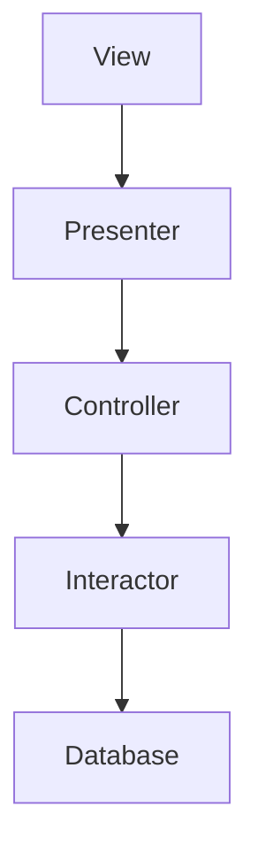

# Clean Architecture オープン・クローズドの原則

* ソフトウェアの構成要素は拡張に対しては開いていて、修正に対して閉じていなければならない。

&emsp;言い換えれば、ソフトウェアの振る舞いは、既存の成果物を変更せずに拡張できるようにすべきである、ということ。

## コンポーネントの関係は単方向

&emsp;コンポーネントAがコンポーネントBの変更から保護されるべきならば、コンポーネントBからコンポーネントA併存すべきである。

&emsp;ここでは、**Presenter**を変更した時に、**Controller**を変更する必要をなくしたい。**Views**を変更した時に、**Presenter**を変更する必要をなくしたい。**他のすべて**を変更したときに、**Interactor**を変更する必要をなくしたい。

&emsp;オープン・クローズドの原則(OCP)に最も適しているのは、**Interactor**である。**Database**、**Controller**、**Presenter**、**View**を変更しても、**Interactor**には何の影響も及ぶさない。

&emsp;**Interactor**が特権的な位置づけになるのは、ビジネスルールを含んでいるからである。**Interactor**は、アプリケーションの最上位レベルの方針を含んでいる。その他のコンポーネントは、周辺にある関心事を処理。**Interactor**は、その中心となる関心事を処理。

&emsp;**Controller**は、**Interactor**の周辺にある関心事だが、その一方で**Presenter**や**View**に対しては中心点な位置づけになる。**Presenter**も、**Controller**に対しては周辺的だが、**View**に対しては中心的な位置づけになる。

&emsp;**Interactor**は最上位レベルの概念なので、最も保護される。**View**は最下位レベルの概念なので、保護レベルは最も低くなる。**Presenter**は、**View**よりも上位にあるが、**Controller**や**Interactor**よりも下位レベルにある概念。

&emsp;これが、アーキテクチャレベルにおけるオープン・クローズドの原則(OCP)。アーキテクトは、いつどのような理由でどのように変更するかを考えて機能を分割する。そして、分割した機能をコンポーネントの階層構造にまとめる。上位レベルにあるコンポーネントは、下位レベルのコンポーネントが変更されたとしても、変更する必要はない。

## 情報隠蔽

&emsp;**Controller**への変更が**Interactor**に影響を及ぼさないようにすることが最優先だが、**Controller**もまた**Interactor**の変更から保護しておきたいので、**Interactor**の内部を隠蔽している。

## まとめ

&emsp;オープン・クローズドの原則(OCP)は、システムのアーキテクきゃの隠れた原動力。目的は、変更の影響を受けずにシステムを拡張しやすくすること。目的を達成するために、システムをコンポーネントに分割して、コンポーネントの依存関係を階層構造にする。そして、上位レベルのコンポーネントが下位レベルのコンポーネントの変更の影響を受けないようにする。

